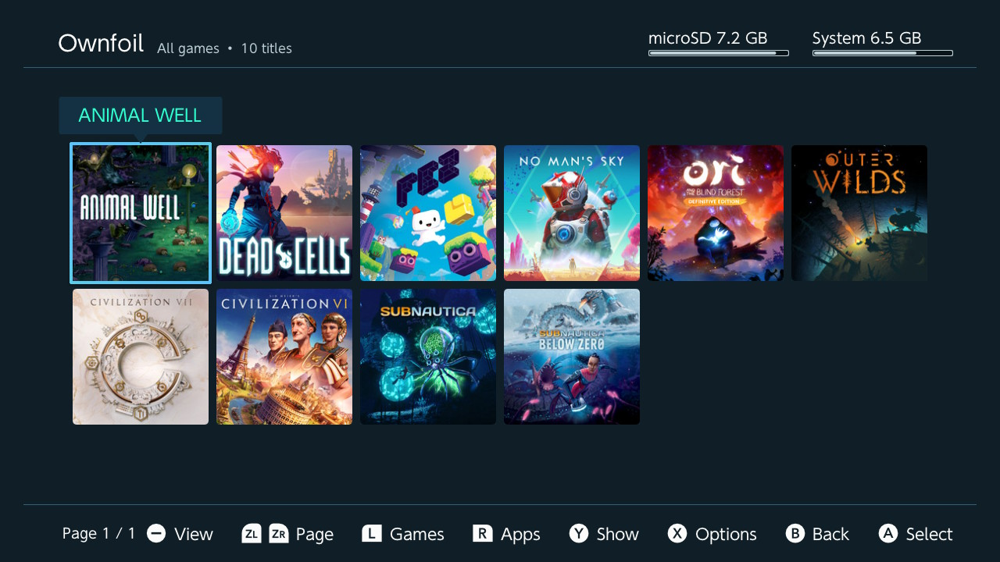
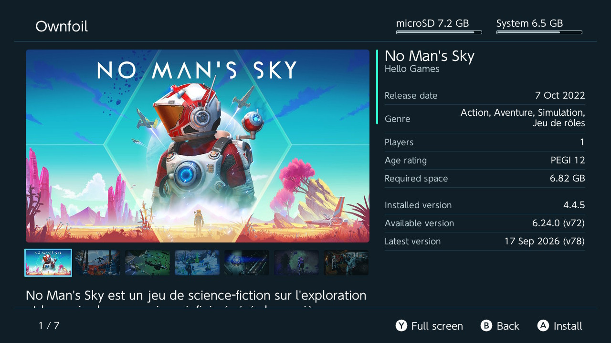

# Kefir Hub

A Kefir-focused homebrew hub for the Nintendo Switch, based on the upstream Sphaira project.

[See the GBATemp thread for more details / discussion](https://gbatemp.net/threads/sphaira-hbmenu-replacement.664523/).

[We have now have a Discord server!](https://discord.gg/8vZBsrprEc) Please use the issues tab to report bugs, as it is much easier for me to track.

## Showcase

|                          |                          |
:-------------------------:|:-------------------------:
 | 
 | 
 | 
 | 
 | 

## Bug reports

For any bug reports, please use the issues tab and explain in as much detail as possible!

Please include:

- CFW type (i assume Atmosphere, but someone out there is still using Rajnx);
- CFW version;
- FW version;
- The bug itself and how to reproduce it.

## Documentation & Wiki

Full technical guides, protocols, and documentation are available in the [Documentation Wiki](docs/wiki/Home.md):
- [Installation & USB Protocols Guide](docs/wiki/Installation-and-USB.md) — USB PC install, DBI SPHQ live queue sync, recursive folder install, screensaver.
- [Save Data Management Guide](docs/wiki/Save-Management.md) — Multi-source backups (Kefir Hub, DBI, JKSV, Checkpoint), folder-based restore, uninstalled game save creation, Game Tools save slot manager, MTP read-only saves, WebDAV sync.
- [User Profiles & Account Linking Guide](docs/wiki/User-Profiles-and-Account-Link.md) — Profile management, RomFS donor offline Nintendo Account linking, Official vs Fake status, custom avatars, portable backups.
- [Console Transfer & TegraExplorer Guide](docs/wiki/Console-Transfer.md) — Over-the-air (OTA) Wi-Fi migration of profiles, playtime, and saves, automated TegraExplorer staging.
- [System Firmware & Downgrade Recovery Guide](docs/wiki/Firmware-and-Downgrades.md) — Firmware installation from ZIP/folders, automated post-downgrade fix (`downgrade_fix.te`), automatic themes/translations cleanup.
- [Network & Web Services Guide](docs/wiki/Network-and-Web-Services.md) — Web File Manager (SPA, queue, direct install, gallery), Ownfoil client, NX-Link, FTP, Wi-Fi Manager.
- [System Utilities & Customization Guide](docs/wiki/System-and-Tools.md) — Module Manager with RAM telemetry, Fan Curves, Interface Translations, Forwarder Editor, Theme Creator.
- [Profile & Playtime Migration Deep Dive](docs/account-transfer.md) — Technical reference on Horizon save crypto (0010, 00F0, 0041).

## FTP

FTP can be enabled via the network menu. It uses the same config as ftpsrv `/config/ftpsrv/config.ini`. [See here for the full list
of all configs available](https://github.com/ITotalJustice/ftpsrv/blob/master/assets/config.ini.template).

## MTP

MTP can be enabled via the Network menu. You can configure which MTP storages are visible and set custom display names for them under **Settings -> Network -> MTP storages**. This allows you to toggle the visibility of the microSD card or the Install folder, and customize how they appear on your PC (e.g. setting a custom label instead of the default "microSD card"). If all storages are disabled, the MTP server will refuse to start and notify you.

- **Games Drive (read-only NSP dumping over USB):** Enabling **Show Games (read-only)** adds a drive that lists every installed title as a folder (`Game Name [TitleID]`), holding one NSP per installed component - the base game, its update and each DLC. The NSP does not exist on the microSD card: it is built from the installed content the moment you open the folder and streamed straight out of content storage, so copying one to the PC dumps that title without needing any free space on the console. Tickets are fetched and patched exactly as the Games menu dump does.
- **NAND Saves Drives (raw DISA saves over MTP):** Enabling **Show NAND Saves (USER:/save)** and **Show NAND System Saves (SYSTEM:/save)** exposes the raw internal save partition files (`000000000000001e`, etc.) over USB with full read and write capabilities, matching DBI Explorer format for direct save backup and restoration.
- **Packed / Raw Save Restoration (DISA containers):** Sphaira supports restoring both unpacked ZIP backup archives and packed monolithic save files (`000000000000001e`, `.disa`, `.bin`) directly to the console's NAND save partition from the Save Menu or via the **Restore save data** action in the File Browser.
- **Save Hub & Categories:** Entering **Saves** presents 3 dedicated categories: **Installed Games** (active saves for installed titles), **Deleted Games** (orphaned saves for uninstalled games), and **Backups** (all discovered backup files and archives across storages). Use shoulder buttons **L** and **R** (or tap footer hints) to quickly switch between tabs anytime.
- **Custom Save Backup Search Paths:** Configure additional folders to scan for save backups under **Settings -> Saves -> Save Backup Search Paths** using the folder picker. Discovered backups in these folders are indexed alongside standard paths (`/dumps` and `/switch/DBI/saves`).
- **External MTP Devices (MTP Host Drive Support):** Connecting a smartphone or external media device in MTP mode via a USB OTG cable mounts its internal storage and SD card directly in the root of Sphaira's File Manager (`System Root`), alongside the microSD card and USB Mass Storage drives. You can browse, view, copy files between your phone and the console's SD card, and install games directly from external MTP devices.
- **Dynamic MTP Control in Tools:** The context menu in **Tools -> Install & Share** features a dynamic **Mount MTP** button. Once MTP is connected, the label automatically changes to **MTP: Active** (rendered in bold for high visibility). Clicking it again stops the MTP connection and reverts the label dynamically.
- **Robust Repack Installations:** The installation engine features enhanced error recovery when installing repacked or trimmed NSP/NSZ files via USB MTP. If a file is slightly truncated or missing non-critical padding bytes at the end of a stream (common in repacked titles), the installer automatically handles the EOF condition gracefully instead of failing with `Unexpected EOF` or `Invalid Read Size` errors, completing the installation successfully.
- **Streamlined Streaming Installation Controls (MTP, FTP, HTTP):** While installing via MTP, FTP, or HTTP Web Install, press **X** to cancel the installation session (protected by a confirmation prompt). Button **B** is unused during streaming installations to prevent interrupting in-flight network/USB host streams. When all packages conclude and no incoming transfer is active, a 3-second grace period allows the installer to settle before transitioning to the Summary screen.
- **Background Minimization & Quick Expand (USB & Transports):** Press **L3** (Left Stick Click) during USB PC Install (or MTP/FTP/Web transfers) to minimize the installation screen into a compact top-right status badge (`USB · 1/3 (45%)  Expand`). While minimized, you can freely browse file directories, tools, and games while transfers continue uninterrupted in the background. Press **L3** or tap the badge via touchscreen at any time to instantly expand back into the full installation menu. Minimize/Expand is also available during the USB connection wait and review queue stages.
- **Enhanced DBI USB Protocol & SPHQ Live Queue Sync:** Extended the DBI USB communication protocol for bidirectional integration with PC installer clients (such as DBI Backend Qt):
  - **Live Bidirectional Queue Sync (SPHQ):** Host PC clients can push an updated queue list (`SPHQ` packet with a revision counter) in real time both while reviewing the queue and during active package installation. Sphaira checks for updates at safe `FileRange` boundaries without interrupting active transfers, applying additions, removals, or re-ordering dynamically to upcoming packages and returning revision acknowledgements (ACK). Empty queues are cleanly confirmed via the `::SPHQ::\n` marker.
  - **Dynamic Per-Package Storage Re-evaluation:** In `Auto` storage mode, Sphaira re-evaluates the destination (NAND vs microSD) immediately before installing each individual package, verifying the actual uncompressed size against real-time free capacity.
  - **Live Storage Target Selection:** Supports receiving target destination preferences (`Auto`, `microSD`, or `NAND`) per queue entry from PC client list descriptors (`file|size|selected|target`), adjusting planned installation targets and storage allocations dynamically.
  - **Live Package Status Reporting:** Sends discrete package completion status notifications (`Installed`, `User Skipped`, `Already Installed`, or `Failed`) alongside exact Horizon Result codes back to the PC client via `CmdId::PackageStatus` (`0x04`).
  - **Dynamic Storage Info Reporting:** Continuously transmits current NAND and microSD free/total capacities via `CmdId::StorageInfo` (`0x05`) to update client storage gauges in real time.
- **Dynamic Navigation & Minus Button:** Pressing **Minus (-)** dynamically detects the current location: if already on the Homebrew screen, it exits the application; if inside any nested file or folder picker (such as avatar or path selection), it cleanly cancels the picker and returns to the calling menu; if pressed from any other screen, tool, submenu, or sidebar, it immediately navigates straight back to the Homebrew screen in a single press.

### Web File Manager

Sphaira includes an HTTP-based Web File Manager (accessed via `http://kefir.local` or the console IP on standard port 80, with automatic fallback to ports 8080–8090, when enabled under the file options via the **Start Web Server** action, which is localized across all 14 languages) to browse, download, upload, delete, and view files on the console directly from a web browser:
- **Single Page App (SPA) Navigation:** Transitioning between folders is completely dynamic and does not trigger browser page reloads. The interface queries directory listings via JSON dynamically, keeping the upload/download queue state active even when navigating through folders.
- **Sequential Queue with Cancellation:** Features a robust upload/download queue that runs transfers sequentially one after the other. Each entry in the queue displays its own individual progress bar, speed tracker, and an independent cancel button (marked as an 'X') on the right to terminate transfers on the fly.
- **Direct Game Installation (NSP/NSZ/XCI/XCZ):** When adding game files to the upload queue, you can check the "Install directly" option. The web server will stream the incoming HTTP upload socket data directly to the Switch's internal game installer (`yati`) on the fly, installing the game directly on the console without saving the intermediate file onto the SD card.
- **Dynamic Storage Target Selection:** Automatically determines the target storage (SD Card vs System Memory) for each game installation. It estimates the uncompressed size of the package (`1.6 * compressed_size` for compressed formats like NSZ/XCZ, or the file size for NSP/XCI) and checks the available NAND USER space. If installing to System Memory leaves at least 500 MB of free space, it selects System Memory; otherwise, it defaults to the microSD Card. This applies to network, USB, and local installations.
- **Touch-Interactive Stop Button:** The console's server wait dialog includes a prominent touch-enabled red **Stop** button and a sub-label helper ("Press B to Stop Server") to easily terminate the server and exit the dialog.
- **Checkbox Selection & Batch Operations:** Displays checkboxes next to files and directories in list and grid views, allowing bulk selection. The bottom toolbar provides options to delete all selected items or download them collectively.
- **Recursive Directory Deletion:** Select folders and delete them recursively directly from the browser window (performing safe recursive deletion on the console's filesystem).
- **Bulk Download as ZIP:** Select multiple files or entire folders to download them as a single packaged ZIP file. The ZIP archive is generated on-the-fly directly in the client browser's memory without compression, shifting the processing load entirely to the user's computer and keeping the console's CPU and RAM free.
- **Direct Image Viewer:** Image files (PNG, JPG, JPEG, GIF, BMP) are highlighted as `[I]` in the directory listing and open directly on the page in a seamless lightbox viewer.
- **Dedicated Screenshot Gallery:** Serves a beautiful, interactive gallery at `/album` that scans the console's `/Nintendo/Album` folder. The screenshots and videos are sorted chronologically by date (newest first). The interface automatically decodes the Nintendo Switch screenshot filename structure (`YYYYMMDDHHMMSS00-TITLEID.ext`) to show formatted human-readable dates (e.g., `YYYY-MM-DD HH:MM:SS`) and looks up the Title ID to retrieve the game's actual display name. It features built-in video playback controls for MP4 captures, an adaptive grid view (4 columns on mobile), and quick switching links between the file browser and screenshots gallery.
- **Tools Menu Integration:** Press **Plus** (START) in the console's **Tools** menu (or any other option-enabled menu) to open the Network Server or context options. Launching the Web Server starts the universal shared instance providing both file browsing and screenshot management.

## AppStore

Sphaira includes a built-in, high-performance Homebrew AppStore client designed for seamless package discovery and maintenance:
- **Installed vs Store Version Tracking:** App cards display both the repository version (`version: ...`) and the locally installed version (`installed: ...`), determined from `.info` metadata or parsed directly from NRO NACP headers. When an update is available, the installed version is highlighted with the active theme's accent color.
- **LibRetro Nightly Buildbot Integration:** For RetroArch (`RetroNX`), downloads and updates are automatically routed to the official LibRetro Nightly builder (`https://buildbot.libretro.com/nightly/nintendo/switch/libnx/RetroArch.7z`), ensuring modern Atmosphere and Horizon OS compatibility. If an outdated store build or non-Nightly package is detected, the `Launch` button is replaced by an `Update` action.
- **Graceful Download Cancellation:** Cancelling a download or uninstall operation at any point cleanly aborts transfer threads and notifies the user with a friendly dialog without triggering false-positive network error alerts.
- **Informative Error Handling & Network Gate:** Download and network operations verify active connectivity before transfer (`RequireConnection`), guiding the user to system Wi-Fi settings when offline instead of failing with raw result codes. Error dialogs feature user-friendly titles (`An error occurred`), localized explanatory guidance, secondary diagnostic codes, and suppress unnecessary bug report prompts on expected network or filesystem conditions.

## Remote Input & Direct Downloads

Sphaira provides an interactive **Remote Input** system that allows users to send URLs, API keys, or arbitrary text fragments to the console directly from a smartphone or PC:
- **Dual Input Modes:** Prompts offer **Manual (Keyboard)** for typing on the Switch's on-screen keyboard, or **From Phone / PC** for scanning a QR code or visiting a local web link (e.g. `http://kefir.local/input` or `http://<ip>/input`, with automatic 8080–8090 fallback).
- **Web Input Interface:** The mobile-responsive `/input` page features clipboard paste integration, live configuration reflection, and support for multiline text payloads.
- **Direct NRO & ZIP Downloads:** The **Custom Link / Direct Download** utility accepts both `.zip` archives (extracted to root with prompt to keep/delete) and standalone `.nro` binaries (saved directly to `/switch/` with an instant launch prompt).
## Interface Translation & Diagnostics

Sphaira features integrated management for Nintendo Switch system interface translations powered by upstream `NX-Family/NX-Translation`:
- **Automated Firmware Matching & Policy Resolution:** Automatically detects installed system firmware (`hats::getSystemFirmware()`) and maps it to upstream release tags:
  - **Exact Match:** When installed firmware directly matches a known translation release (including the newly added `FW22.5.0-TR2.01`), Sphaira uses that release directly without warning prompts.
  - **Latest Translation Fallback (FW 22.5.0+):** When running on firmware newer than the latest known translation release (`22.5.0`), Sphaira automatically utilizes the latest release (`FW22.5.0-TR2.01`) with an advisory confirmation dialog instead of marking the firmware unsupported, eliminating arbitrary version lockouts.
  - **Concrete Intermediate Mapping:** Robust range mappings ensure older and intermediate firmware versions (16.0.0–16.1.0, 18.0.0–18.1.0, 19.0.0–19.0.2, 20.0.0–20.5.0, 21.0.0–22.4.x) cleanly map to tested stable releases.
- **Dynamic Localized Warnings:** Compatibility warning dialogs dynamically insert the target firmware version from the release tag into localized messages across all 14 supported interface languages.
- **Live Diagnostics & Header Stats:** The Translate Interface menu header displays active firmware and target release versions continuously (`FW ...`). A dedicated diagnostics entry at the top of the menu provides full details including detected console region, target release tag, metadata API endpoints, and GitHub release URLs.
- **Transparent Source Previews:** Before downloading translation lists or installing specific language archives, prompts and progress transfers explicitly show the target firmware tag, replacement language variation (`replaces_...`), and full GitHub download URLs.
- **Graceful Fallback & Replacement Choice:** If an exact match for the current console language and region combination is not found, Sphaira allows selecting from all available language replacement variations instead of failing, enabling seamless custom setups.
- **Seamless Background Replacement (Single Reboot):** When installing a new translation while an old one is already present on the SD card, Sphaira purges the previous translation files silently in the background without interrupting the user or forcing an intermediate restart. The new translation is downloaded, extracted, and installed, requiring only a single reboot at the end.
- **Manual Removal with Deferred Reboot Option:** Selecting **Remove installed translation** safely deletes installed translation files from `/atmosphere/contents` and presents an advisory prompt allowing the user to choose between **Reboot now** (recommended) or **Reboot later**. A warning informs the user that while loaded in-memory strings won't crash the console, rebooting now is recommended to avoid text or interface display inconsistencies. If deferred, users can continue browsing and working in the app freely.

## Profiles and Playtime Transfer & TegraExplorer Payload Integration

Sphaira / Kefir Hub provides full user profile and play activity transfer between consoles, utilizing TegraExplorer to dump and restore locked system saves (`0010` accounts and `00F0` play activity) safely outside Horizon OS:
- **User Profile Creation & Graceful Cancellation:** Users can manage local accounts and create new user profiles directly from the Users menu via the Horizon OS user creation applet (`pselShowUserCreator`). If the user cancels the creation applet before completing, Sphaira handles the cancellation cleanly without presenting spurious error dialogs.
- **Embedded RomFS TegraExplorer & Version Synchronization:** Sphaira bundles the latest compiled TegraExplorer payload in its RomFS (`romfs:/tegra/TegraExplorer.bin`). Before launching any payload operation (`ensureTegraExplorerPayload`), Sphaira checks `/bootloader/payloads/`:
  - If TegraExplorer is missing from the SD card, it is automatically installed from RomFS.
  - If a copy exists, Sphaira reads and parses the binary payload footer (`KFRP`). If the SD card copy is older than the RomFS version, it is safely upgraded in-place.
  - If the SD card already contains a matching or newer version, it remains untouched.
- **Seamless Automated Reboot to TegraExplorer:** When performing **Backup profiles & play hours**, Sphaira automatically stages the dump package metadata and writes the automation script to the root of the SD card as `/startup.te`. Without requiring intermediate confirmation dialogs, it automatically executes a clean reboot into TegraExplorer.
- **Hekate Payload Launch & Swap Fallback:** Payload launching (`utils::rebootToPayload`) natively communicates with Hekate's one-shot payload launch API (`/config/kefir/hekate-payload-request.ini`). If the capability marker is missing or writing fails, Sphaira seamlessly falls back to swapping `/payload.bin` with the target payload while safely preserving Hekate in `/bootloader/update.bin`, alongside configuring temporary autoboot in `hekate_ipl.ini` (safely backed up to `.bak`) before requesting a system reboot via `appletRequestToReboot`/`spsm`/`bpc`.
- **Diagnostic Dashboard UI & Live Spinner:** Both dump and restore automation scripts in TegraExplorer run inside a full-screen diagnostic dashboard featuring a custom pixel-rendered header banner (`setpixels`), an animated hardware spinner (`spinner(1, 77, 0)`), real-time status tables (Source NAND, Target Pack, individual save status for `0010`, `0011`, `00F0`, `0041`, files written, and error counts), safe line-length protected activity tickers, and rolling event logs (`Event Log`).
- **Result Verification, Payload Restore & 5-Second Auto-Reboot:** When dump or restore scripts run in TegraExplorer, they immediately disarm the swap and restore Hekate from `sd:/bootloader/update.bin` back to `sd:/payload.bin`, as well as restoring `hekate_ipl.ini`. Upon completion (or failure), they display a clear color-coded summary, cleanly clean up temporary files, ensure `/payload.bin` is restored, and automatically reboot back into Hekate (`sd:/bootloader/update.bin`, `sd:/payload.bin` on Kefir builds) after a 5-second countdown grace period without requiring manual button presses.
- **Flushed SD Synchronization & Automatic Cleanup:** Staged `/startup.te` scripts are flushed via `fflush`, `fsdevCommitDevice("sdmc")`, and native filesystem commits before reboot commands are issued, ensuring zero-byte corruption is prevented even during sudden hardware restarts. Upon completion in TegraExplorer or cleanup inside Kefir Hub, temporary `/startup.te` and handshake files are automatically purged and the original `hekate_ipl.ini` is restored.
- **Manage Backups Context Menu, Remote Transfer & Legend Parity:** Entering **Manage Backups** (for both individual user backups and NAND profiles & play hours packs) provides full context menu support via **Plus (+)** (or tapping **Options** on the touch bar), mirroring all legend actions with clean vector iconography:
  - **Open & Direct Restore:** Open pack details to inspect accounts or trigger a direct **Restore** immediately from the context menu (with profile only or profile + playtime options).
  - **Custom Renaming:** Easily rename backup folders or archives with on-screen keyboard (`swkbd`) validation and sanitization.
  - **Send to Another Console:** Start the Console Transfer share server directly from the backup menu to transfer user backups or profiles & playtime packs to another Nintendo Switch or PC over local Wi-Fi.
  - **Receive & Restore from Another Console (Over-the-Air Console Move):** Transfer profiles and playtime packs directly between consoles over local Wi-Fi without manual SD swapping:
    - **Receive from another console:** In **Manage Backups** (`+` Options) or the Tools -> Users sidebar, enter the sending console's IP address to browse remote packs and download selected backups (or all backups at once) to `/config/kefir/nand_transfer/`.
    - **Restore from another console:** In **Restore profiles & play hours** (`+` Options), individual pack details, or the Tools -> Users sidebar, enter the sender's IP address to select a remote backup. Sphaira downloads the pack locally to SD first, then immediately prompts to restore profiles (or profiles + play hours) via automated TegraExplorer staging.
  - **Complete Selection & Legend Parity:** Full access to **Select / Deselect** (toggling focused item, mirroring Button **X**), **Select All**, **Clear selection** (mirroring Button **B**), **Invert** (mirroring Button **Y**), and **Delete** (mirroring Button **Minus** / Select) directly from the options menu for inattentive users who prefer using the context menu over gamepad button shortcuts.

## System Firmware Updates & Automated Downgrade Fix

Sphaira provides full support for managing and installing Nintendo Switch system firmware updates and downgrades directly through **Kefir Updater**:
- **Automated Post-Downgrade Fix (`downgrade_fix.te`):** When installing an older system firmware version (downgrade), Sphaira automatically stages an automated recovery script (`sd:/startup.te`) and launches TegraExplorer upon rebooting. The script disarms itself immediately to prevent bootloops, mounts the appropriate `SYSTEM` partition (EmuNAND or SysNAND), deletes system save `8000000000000073` to prevent Horizon OS downgrade panic errors, removes conflicting custom themes (`0100000000001000`, `0100000000001013`, `0100000000001007`, `00FF007468656D65`) and system translations (`0100000000000803`...`0100000000001015`), and reboots smoothly back into Hekate without requiring user button presses.
- **Automatic Themes and Translations Removal on All Updates:** To prevent fatal crashes (`2162-0002`) and qlaunch incompatibilities after upgrading or changing system firmware, Sphaira unconditionally cleans all installed custom themes and interface translations from the microSD card (`/atmosphere/contents/`) immediately after applying any firmware installation, ensuring a smooth and crash-free reboot. Application-specific homebrew files (such as DBI translations) are safely preserved.
- **Comprehensive Maintenance Mode Instructions:** The pre-downgrade warning dialog explains how to enter Horizon's Recovery / Maintenance Mode (`Volume +` and `Volume -` held after the bootlogos) and choose "Initialize Console Without Deleting Save Data". It also clarifies that after initialization, the SD card's `Nintendo` folder will become invalid and the console will prompt to delete it, reassuring the user that agreeing to delete it will NOT affect their saved games.
- **Manual Guide Link & QR Code:** Features a scan-ready QR code and direct URL pointing to the official downgrade documentation (`https://switch.customfw.xyz/downgrade_fw`).
- **Fully Localized Update & Reboot Notifications:** All firmware update confirmation prompts, validation error messages, downgrade recovery notices, theme/translation cleanup warnings, and post-installation reboot requests are fully localized through Sphaira's `i18n` translation engine across supported languages.

## File association

Sphaira has file association support. Let's say your app supports loading .png files, then you could write an association file, then when using the file browser, clicking on a .png file will launch your app along with the .png file as argv[1]. This was primarly added for rom loading support for emulators / frontends such as RetroArch, MelonDS, mGBA etc.

```ini
path=/switch/your_app.nro
supported_extensions=jpg|png|mp4|mp3
```

The `path` field is optional. If left out, it will use the name of the ini to find the nro. For example, if the ini is called mgba.ini, it will try to find the nro in /switch/mgba.nro and /switch/folder/mgba.nro.

See `assets/romfs/assoc/` for more examples of file assoc entries.

## Installing (applications)

Sphaira can install applications (nsp, xci, nsz, xcz) from various sources (sd card, gamecard, ftp, usb).

For informantion about the install options, [see the wiki](https://github.com/ITotalJustice/sphaira/wiki/Install).

### Usb (install)

One screen — **PC Install (USB)** under Install & Share — handles every supported PC app. Sphaira works out which protocol the far end speaks when it connects, so there is nothing to pick on the console; the queue names it in the session log once it knows.

- **DBI Backend** (DBI0): the official `dbibackend.py` and its companion executables. Random-access block reads. When the backend understands sphaira's list request it also reports each file's size, which is what lets the queue show real totals before the first byte is written.
- **Awoo/TinFoil** (TUL0/TUC0): the PC pushes the file list, Sphaira pulls ranges. Used by [ns-usbloader](https://github.com/developersu/ns-usbloader) in *TinFoil* mode and by [fluffy](https://github.com/fourminute/Fluffy).
- **GoldLeaf** (GLCI/GLCO): the roles are reversed — Sphaira drives a remote filesystem on the PC. Used by ns-usbloader in *GoldLeaf v0.10+* mode. Sphaira installs everything on the `VIRT:/` drive, i.e. exactly the files queued in the ns-usbloader window; browsing the PC's own filesystem (`HOME:/`) is not supported.

The queue reviews every package before it installs any of them, so a host in **stream mode** is refused with a message rather than served — turn stream mode off in the PC app.

In the queue review screen, pressing **X** toggles package selection and automatically steps the cursor onto the next item for seamless bulk configuration. Pressing **Y** inverts selection, and **A** begins installation.

During active installation, you can control the queue on the fly: press **B** to skip only the current package and proceed to the next queued item, or press **X** to cancel the remaining queue (both actions display an explicit confirmation dialog before interrupting).

The USB installation waiting screen features an intelligent **USB 3.0 Status Indicator** and dynamic layout:
- **USB 3.0 & Link Speed Badge:** Automatically detects whether USB 3.0 is force-enabled in Atmosphère configuration (`system_settings.ini`) and queries real-time hardware link speeds, rendering a dedicated badge with vector USB iconography (e.g. `USB 3.0 SuperSpeed (5 Gbps)` vs `USB 2.0 High Speed (480 Mbps)`). When USB 3.0 is enabled in settings, an ambient `[ USB 3.0 ]` indicator also appears in the top status bar above the NAND/SD storage meters.
- **Dynamic Anti-Overlap Spacing:** All text boxes and Applet Mode warning cards dynamically calculate vertical rendered bounds (`nvgTextBoxBounds`), ensuring instructions, connection badges, and warning boxes remain perfectly spaced and never overlap across all screen orientations and translated languages.

Long queues do not need the panel on: **Minus** blanks the screen, and *Settings → Install → Screen off (Minus)* chooses between lowering the brightness, cutting the backlight, and a drifting black-background readout (clock, package counter, progress, speed, ETA, battery, real-time speed graph). While the screensaver is active, system auto-sleep and display turn-off are strictly inhibited, and hardware OLED consoles automatically maintain the user's configured brightness against true black pixels without aggressive panel dimming (while LCD consoles reduce brightness to conserve battery). While the screensaver is active, you can interactively fly the readout around with the **Left Analog Stick**, adjust screen brightness with the **Right Stick (Up/Down)**, and speed up or slow down drift with the **Right Stick (Left/Right)**. Any button brings the screen back.

- **Clean Game Title Display:** The screensaver and installation view strip internal NCA/NCZ hash strings (e.g. `dd38de587cb690a36b1d4b6ca4.nca`), presenting clean, human-readable game titles (or package filenames when metadata is pending) and descriptive stage notices (such as database updates).
- **Adaptive Title Rendering:** The screensaver features an expanded 840px display track with adaptive font scaling and left-edge anchoring for lengthy titles, ensuring game names are always readable in full and never clipped at the start.

### Forwarder Editor & SteamGridDB Integration

Sphaira includes a dedicated **Forwarder Editor** (`Tools -> Create Forwarder` or options menu on any NRO / homebrew item) to generate HOME Menu forwarder NSPs:
- **Automatic Forwarder Detection & Silent Background Installation:** On application startup, Sphaira automatically checks whether a Homebrew Menu or Kefir Hub forwarder is already installed on the console (checking standard title IDs `010000000000100D`, `050000000000100D`, as well as generated forwarder IDs). If no forwarder is found, Sphaira transparently generates and installs a Kefir Hub HOME Menu forwarder in a background thread via Yati without interrupting the user or prompting to restart. To prevent Nintendo account and hardware bans, Sphaira checks whether an EmuNAND is configured on the system: if an EmuNAND exists on the SD card but the console is currently booted into SysNAND or Semi-stock (ending with 'S' in System Settings), automatic forwarder installation is strictly suppressed so the clean SysNAND remains untouched.
- **Accurate EmuNAND vs NAND Environment Indicators:** The top status bar storage indicator dynamically checks whether custom firmware is currently executing inside an emulated environment (EmuMMC). The label displays **EmuNAND** strictly when booted in EmuNAND ('E' in console settings), and displays **NAND** when booted in SysNAND or Semi-stock ('S' in console settings), replacing legacy static labels.
- **SteamGridDB Icon Picker:** Search [SteamGridDB](https://www.steamgriddb.com) directly from the console to select high-quality vertical icons. You can paste an API key manually or use the built-in **Web Handoff** (`/apikey` endpoint) by scanning a QR code with a phone on the same Wi-Fi. The API key request endpoint is securely gated (`404 Not Found` when handoff is inactive) and saved to `/config/kefir/config.ini` in plain text (`[steamgriddb] api_key`).
- **Per-Forwarder Launch Options:** New forwarders default to 39-bit address space and 3 CPU cores. Forwarder Options offers 36-bit compatibility and an explicit, warned 4-core choice, alongside profile selection, capture, and `svcDebug`; **Ask every time** opens these choices for each forwarder.
- **Dual-Pane D-Pad Navigation & Safety:** Features intuitive focus switching between the left icon preview and the options list (press **DOWN** or **RIGHT** to enter settings, **LEFT** or **UP** from the top row to return to icon focus), with robust pointer safety across all controller and touch update loops.

### Automatic Silent Update & Self-Updating

Sphaira / Kefir Hub includes an intelligent, non-blocking **Automatic Silent Update** system:
- **Background Release Detection & Download:** On startup, the application queries GitHub Releases (`https://api.github.com/repos/rashevskyv/kefir-hub/releases/latest`) in the background. An update is only offered or installed if the remote release version is strictly newer than the installed application version (`version::IsNewer(APP_VERSION, remote_version)`), preventing test-mode regressions, inadvertent downgrades, or false updates triggered by empty/malformed versions or rate-limit HTTP responses. Parsing uses a zero-allocation, stream-free scanner independent of C++ locale/iostreams, correctly handling multi-part numbers over 255 and stripping `v`/`V` prefixes. If a strictly newer release is detected, it selects the matching binary asset (`kefir-hub.nro` / `sphaira.nro`), downloads it asynchronously to staging cache without UI stalls, and prioritizes `/switch/kefir-hub/kefir-hub.nro` during installation.
- **Safe Atomic Replacement:** Once verified, the update replaces the active executable path (`App::GetExePath()`) atomically. If `Replace hbmenu on exit` is enabled, `/hbmenu.nro` is also seamlessly kept up to date. The update is applied completely silently in the background without popups or prompts; the new version will seamlessly run the next time the application is opened.
- **Configurable in Settings:** Can be enabled or disabled via **Settings -> General -> Auto-update** (enabled by default).
- **About Screen & Changelog Viewer:** View the current application version, repository link, and browse release notes / changelogs directly under **Settings -> General -> About**. Includes rich markdown rendering, smooth scrolling (analog sticks, d-pad, L/R page jumping, and touch dragging), and an instant refresh option (press **X**).

### Safe Homebrew NRO Customization

Customize NRO metadata and icons directly from the Homebrew menu via **Customize Homebrew**:
- **Atomic 4-Step Update & Memory Optimization:** Modifies NRO RomFS assets streaming 64 KiB chunks into a temporary file (`.sphaira.tmp`) without duplicating the NRO vector in RAM (reducing peak heap usage from 2x to 1x NRO size). Uses a 4-step atomic rename algorithm (`tmp -> bak -> path`) with pre-deletion of stale `.bak` files and on-disk size verification before touching original files, protecting against SD write failures.
- **Asynchronous Worker:** Runs NRO updates asynchronously in a background progress box while synchronously releasing the editor UI.

### Game Details & Header UI Layout

Sphaira provides a DBI-style **Game Details** card and status bar header layout:
- **Header Storage Bars, Services & System Info:** Real-time NAND and SD card storage indicators with compact, high-legibility font sizing and right-aligned status indicators (clock, battery, Wi-Fi SSID and IP address with anti-overlap marquee scrolling). Prominent **MTP**, **FTP**, **USB 3.0**, and **EmuNAND / SysNAND status badges** sit directly above the storage meters (adaptively displaying `[ ● EmuNAND ]` in full or compact `[ ● E ]` when USB 3.0 is active). System information in the version block displays pure versioning (`<Kefir> · <FW>|AMS <AMS>`) with 3-way symmetric spacing across the storage span ($M = (W_{span} - (W_1 + W_2)) / 3$).
- **Logical Stat Blocks:** Game details statistics are neatly organized into 4 logical blocks (Title ID & Version, Languages & Mods folder, Play time & Last played, Components/Tickets/Saves & Save quota). All values within each block align strictly to a single vertical column, with long translated labels automatically scrolling when exceeding 1/3 of the row width.

### Ftp (install)

Once you have connected your ftp client to your switch, you can upload files to install into the `install` folder.

### Ownfoil (install)

[Ownfoil](https://github.com/a1ex4/ownfoil) is a self-hosted Nintendo Switch library manager, automating library curation tasks and making backups available to install directly on your console.

Local servers are found automatically on the network, so there is no ip or port to type in. Each server can have both a local and a remote address, over http or https, and signs in with a user account.

The library is browsed by *content*, not by files: pick a game, a version and the dlc you want, and Sphaira works out which files it needs, however they are bundled (several nsp, or a multi content nsp / xci).
Only what you picked is downloaded and installed. nsp, nsz, xci and xcz are supported, and a download survives a broken connection, resuming for up to 60s.

Entries are listed under `New games`, `Updates`, `DLC`, `All games` and `Search`, paginated and sortable. All artwork is served by the Ownfoil server, so the switch never connects to Nintendo's servers.

### NX-Link (Network NRO Launch & Transfer)

Sphaira features an embedded NX-Link server allowing wireless deployment and execution of NRO homebrew binaries directly over local Wi-Fi:
- **Filesystem Commit & Corruption Protection:** After receiving, writing, and renaming incoming NRO binaries, Sphaira executes explicit filesystem commit operations (`fs.Commit` and `fsdevCommitDevice("sdmc")`) before execution handoff (`launch_internal` / `envSetNextLoad`) and during process exit (`userAppExit`), guaranteeing FAT32/exFAT allocation tables and dirty blocks are fully flushed to the microSD card controller and preventing SD card drops or filesystem corruption on slow storage.
- **Race-Free Logging & Heap Protection:** Network log broadcasting in the background flusher utilizes direct non-blocking `send()` calls over socket descriptors rather than shared stdio streams (`stdout`), preventing newlib memory allocator collisions and eliminating heap chunk corruption (`_malloc_r` Data Abort `0x4A8`) during startup image decoding.
- **Path Normalization:** Received file paths are automatically sanitized (stripping redundant `sdmc:/` prefixes and enforcing native absolute paths), ensuring full compatibility with Horizon OS filesystem services.
- **Safe Buffer Bounds:** Arguments and connection packets are bounds-checked with guaranteed null-termination.

### Homebrew Loader Safety (HBL & Forwarder Isolation)

The built-in Homebrew Loader (embedded within forwarder NSPs and chainloader pipelines) includes hardened NRO parsing and memory isolation:
- **Exact Code Segment Reading:** Sequentially reads exact `NroStart` (16 bytes), `NroHeader` (112 bytes), and payload data strictly up to `header->size`. Appended RomFS assets, NACP metadata, and icons are never read into memory buffers, preventing payload overflow into target program address spaces.
- **Deterministic BSS Memory Zeroing:** The unmapped BSS memory range (`[header->size, (header->size + header->bss_size + 0xFFF) & ~0xFFF]`) is explicitly zeroed before memory mapping (`svcMapProcessCodeMemory`), ensuring target homebrew applications (such as `NX-Activity-Log` and `pipensx`) start with clean uninitialized data sections and eliminating invalid pointer dereferences / Data Abort (`2168-0002`) cache maintenance crashes.
- **Clean OverrideHeap Placement:** Accurately places `OverrideHeap` boundaries (`nro_heap_start` and `nro_heap_size`) immediately following the verified NRO code and BSS segments, guaranteeing that memory allocators (`dlmalloc`) initialize from clean, uncorrupted heap space.

## Fan curves & Fan sysmodule

Sphaira includes a "Fan curve" settings menu under "Kefir Settings" to dynamically configure custom fan speed tables (Handheld and Docked modes).
- **Live Apply:** If the `sphaira_fan` sysmodule (`00FF46554E43544C`, `FunControl`) is installed and enabled, curve changes apply dynamically without rebooting.
- **Save and Reboot:** If the sysmodule is disabled or not installed, curves are saved to `/atmosphere/config/system_settings.ini` for the next boot.
- **Conflict-Free Thermal Sensing:** Uses Nintendo Switch `ts` (Thermal Measurement) service (`tsOpenSession`) to read SoC temperature without IPC session collisions in `ptm`.
- **Live Sysmodule Telemetry:** The background module exports state telemetry (`/switch/sphaira/fan_status.bin`), providing real-time hardware status to Sphaira.
- **Physical Fan Motor Inertia Modeling:** UI graph markers smoothly model physical motor spin-up and spin-down acceleration/deceleration response.

## Module Manager

Manage installed Atmosphere background sysmodules directly from the console interface under **Tools -> Module Manager**.
- **Independent State Tracking:** The module states are clearly separated into two metrics: the current running status (**Now: On / Off**) and the boot-time autostart configuration (**After reboot: Enabled / Disabled**).
- **Module Description Registry:** Shows localized descriptions (supporting English and Ukrainian) in the menu subtitle, loaded from a persistent registry file on the SD card (`/config/kefir/modules.json`). If the registry file does not exist, it is generated with default entries for popular sysmodules (emuiibo, Mission Control, sys-clk, ldn_mitm, sys-ftpd).
- **Reboot-Required Handling:** Safely detects modules that apply only after system reboot, blocking manual process toggles and prompting the user with a helpful notification.

## User Profile Management

Manage Nintendo Switch user profiles directly from **Tools -> Tools -> Users**:
- **Profile Customization & Avatars:** Create, rename, delete, backup, and link user profiles. Set custom profile avatars from existing profiles, SD card images (`/config/kefir/avatars` or file picker), or SteamGridDB search.
- **RomFS Donor Offline Nintendo Account Linking:** Sphaira embeds verified Nintendo Account donor templates directly in RomFS (`romfs:/kefir/donor/`), eliminating the need to install third-party utilities (such as Linkalho) to enable offline account features.
- **Official vs Fake Status Classification:** Profile link status and NAS ID are queried directly through Horizon's BaaS Administrator interface (`GetBaasAccountAdministrator` and `IsLinkedWithNintendoAccount`). Sphaira accurately detects and visually differentiates genuine **Official** Nintendo Accounts from **Fake / Offline** linked accounts with clear, color-coded status badges.
- **Safety Rollback Snapshots & Overwrite Protection:** Before modifying the account system save (`8000000000000010`), Sphaira takes an emergency rollback snapshot to protect against corruption. Official accounts are safeguarded from accidental overwrite unless explicitly confirmed.
- **Dedicated Unlink Action:** Safely remove offline Nintendo Account link tokens from any profile directly via **Unlink** in the options sidebar without deleting the user profile or any associated game saves.
- **Portable User Backups:** Export individual user profile definitions (UID, nickname, avatar, linkage metadata) to standalone, human-readable portable backup archives in `/config/kefir/user_backups/` for archiving or wireless transfer.
- **Reboot Prompt on Avatar Change:** Because Horizon OS only updates profile avatars system-wide (HOME menu and system applets) after a reboot, changing a profile avatar displays a prompt to reboot immediately or reboot later.
- **One-Time TegraExplorer Restore Notification:** When restoring user profiles & play hours packs through TegraExplorer, if restoration does not complete, a concise status notification is presented once upon returning to Kefir Hub, cleanly persisting the applied state so it does not repeat on subsequent launches.

## Wi-Fi Connection Manager

Manage saved wireless network profiles directly from **Tools -> Tools -> Wi-Fi**:
- **Saved Networks List & Status:** View all Wi-Fi networks saved on the console, including active connection state, security protocol (`WPA2-PSK (AES)`, `WPA3`, `Open`), and custom profile names. The currently connected access point is pinned to the top of the list with a highlighted `Connected` badge.
- **Direct Connect (Button A):** Press **A** on any saved network to immediately connect to it with an instant confirmation prompt.
- **Multi-Selection & Batch Deletion:** Select multiple networks with **X** or invert selection with **Y** (or select all from the context menu). Press **+** (START) to open the sidebar and delete multiple selected networks in bulk with a single confirmation.
- **Change Password & Rename:** Update the Wi-Fi security passphrase or rename the profile display name and SSID directly on-device using the software keyboard (`swkbd`), without needing to re-scan or navigate through the official Horizon OS system settings.
- **Password Viewer:** In the context menu, select **View password & details** to reveal the stored network password in plaintext alongside full security and configuration details.
- **Wireless Toggle:** Quickly turn Wi-Fi communication on or off directly from the options sidebar without leaving the menu.

## Themes & Translations

Sphaira features customizable theme options and multi-language support:
- **Theme Options:** Choose interface themes, animated background visuals, and time formats under "Settings -> Appearance -> Sphaira theme options".
- **Interface Translations:** Manage and download translation files to customize your console interface language under "Kefir Settings -> Translate Interface".
- **Full Localization & Sync:** Multi-language interface translations (14 supported languages: English, Japanese, French, German, Italian, Spanish, Chinese, Korean, Dutch, Portuguese, Russian, Swedish, Vietnamese, Ukrainian) are fully synchronized and translated, providing seamless native navigation for all interface texts and settings.
- **Themezer Favorites:** Add any theme pack from Themezer to your favorites list by pressing **R3** (Right Stick click) in the Themezer download menu. Favorites are instantly shown on the main "Themes" tab alongside built-in options, marked with a star icon for easy access and offline viewing.
- **Theme Packages & Instant Installation:** Download bundled theme packages (such as Mario BG Dark and Switch 2 Theme by alexwak) directly from the "Themes" menu under Tools. Once downloaded and extracted to `/themes/`, Sphaira automatically prompts to install the theme immediately via `NXThemesInstaller.nro` with all extracted `.nxtheme` files queued.
- **Themezer Filters:** Browse themes easily by applying filters directly in the "Themezer Options" sidebar. You can filter themes by target layout (e.g., Home Menu, Lock Screen, All Apps, Settings, Player Select, User Page, News) and input custom search tags (separated by spaces or commas). When a target filter is active, the app queries individual themes instead of packs and lists them dynamically, matching them with their parent pack previews.
- **Locked File Bypass & Reboot Recovery:** During interface translation removal, file lock exceptions (`FsError_TargetLocked`) are safely bypassed. Locked files are left behind while deleting everything else, and the system reboots immediately, releasing all filesystem handles and completing the removal process smoothly.
- **Empty Translation Folder Filtering:** The translations menu dynamically hides translation entries that do not have their corresponding JSON localization layout metadata file on the SD card, avoiding empty selection directories and preventing errors like `Result_FsEmpty`.
- **Automatic Localized Interface Switching:** When installing a system interface translation, Sphaira automatically checks if the corresponding language is supported in its own settings (e.g., matching Ukrainian, Portuguese, or Vietnamese). If supported, Sphaira switches its own language layout configuration to match the installed translation on the fly, allowing a seamless experience right after the system reboot without manual settings adjustments.
- **DBI Management & Fan Translations:** Under "Settings -> Software -> DBI", Sphaira provides integrated management for DBI installer builds and translations:
  - **Pinned Utility Controls:** Primary operations ("Download DBI translations list" / "Update DBI translations list", "Russian latest DBI", and "Reset DBI config") remain pinned at the top of the menu.
  - **Dynamic List Action:** The translations action dynamically toggles between "Download DBI translations list" and "Update DBI translations list" once package definitions are loaded.
  - **Visual Divider & Alphabetical Ordering:** When translations are downloaded, a clear divider separates the top utility actions from the fan translations list, with entries sorted alphabetically for effortless browsing.

## Image Viewer

Sphaira provides an integrated image viewer with dedicated legend and controls:
- **Uncluttered Header & Full-Width Title:** NAND and SD storage bars are cleanly omitted in the image viewer, giving the filename the full header space from the left margin up to the clock.
- **Adaptive Title Scaling & Scrolling:** If an image or menu title is long (e.g. Switch screenshot filenames like `2026081517021600-57B4628D2267231D57E0FC1078C0596D.jpg`), the font size automatically scales down by up to 40% (down to 16.8px) to fit the available space, and seamlessly scrolls if it still exceeds the space at minimum font size.
- **Two-Row Pixel-Balanced & Justified Footer Legend:** When an extensive set of actions is active or when translated text exceeds single-line width, footer action hints automatically format across two rows balanced by occupied pixel width (minimizing width disparity between rows). Each row dynamically distributes spacing between items to occupy the full width of the footer (`30px` to `1220px`), providing large fonts and complete edge-to-edge touch hitboxes with zero dead zones.
- **Custom Legend & Standard Chrome:** Clear bottom-bar indicators (unified `Prev / Next Image` with `\uE0ED / \uE0EE` for D-Pad Left/Right, `Zoom Up / Down` for ZL + Stick Up/Down, and `Full Screen` for ZR). Normal view preserves standard screen header/footer chrome above image content, while Full Screen mode expands to full display without chrome.
- **Zoom & Navigation:** Holding ZL with Analog Stick / D-Pad Up or Down zooms in or out without accidentally changing images.
- **Stick Panning:** Releasing ZL while zoomed in enables smooth pan/scroll across the zoomed image using analog sticks or D-Pad without scale changes or switching files.
- **On-the-Fly Rotation:** Press **L** to rotate counter-clockwise (90°) or **R** to rotate clockwise (90°). Rotation dynamically adapts viewport framing, zoom, and panning bounds in memory without modifying image files on disk.

## File Browser

Sphaira includes a robust file manager with standard operations (Cut, Paste, Rename, Delete, Create File/Folder, Extract/Compress zip, Install/Forwarder) and write protection handling:
- **Recursive Folder Installation ("Install recursively"):** In the folder options sidebar (or when multiple folders are selected), select **Install recursively** to automatically traverse all subdirectories, aggregate every discovered NSP, NSZ, XCI, and XCZ package, and open the Review Queue for batch installation.
- **Nested File Browser Cancel (Minus Button):** When the File Browser is launched as an in-app file or folder picker (such as selecting custom avatar images, firmware directories, or backup search paths), pressing **Minus (-)** cleanly cancels the picker and returns to the previous menu rather than exiting the application.
- **View Options & Vector Iconography:** Toggle between **List** and **Icon** / thumbnail preview mode in the **View** submenu alongside sorting (by size or name) and visibility settings. In grid view mode, folder entries render a sharp, resolution-independent vector silhouette with consistent label centering under tiles in all hover states.
- **Network Storage Sources (SMB, WebDAV, FTP, HTTP):** Mount and browse network folders directly in the file manager. Select "+ Add network location" in the "Sources" settings category or directly in the file browser sources picker. Supported protocols include Samba (SMB), WebDAV (HTTPS/HTTP), FTP, and HTTP. Connection is established asynchronously using a progress screen and locations are saved to `/config/kefir/locations.ini` (Note: credentials are saved in plain text for compatibility with NXMP). You can browse network folders as native directories, perform file operations (Copy, Paste, Delete, Rename, Create Folder), play audio or video files from them using NXMP, and upload files to them.
  - **Hierarchical System Root Navigation:** Pressing **Back (B)** at the root of microSD card or any mounted storage navigates one level up to a virtual **System Root** view instead of exiting the file browser. This view lists the microSD card, system partitions (NAND/SD Image if God Mode is enabled), and all configured network locations.
  - **Connection Status Badges:** Configured network locations in the System Root view display a visual connection status indicator in the bottom-right of their folder icon: Green (connected/mounted), Grey (unknown/disconnected), and Red (failed/error). Selecting a disconnected location automatically triggers a connection attempt and mounts it.
  - **Right-Aligned Sidebar Context Menu:** Pressing **Plus** (START) on any network location in Settings opens a modern right-aligned sidebar options menu (replacing the old bottom popup list) to quickly Connect, Edit, Rename, Test, View Properties, or Delete the location.
  - **Connection Testing:** Includes a dedicated "Test Connection" tool both in the location options sidebar and the individual edit menu. It executes a real-time connection check (using `CSMB2FS` query for SMB and light HTTP/FTP metadata queries via `curl` for other protocols) and displays real-time progress followed by success/failure notifications.
  - **Auto URL Formatting on Input:** When adding a new network location, if you enter a URL-like string (containing schemes, hostnames, or local IP addresses) in the "Location Name" Swkbd prompt, it is automatically parsed and copied over as the target Server URL with the correct protocol scheme prefix (e.g., `smb://`, `webdav://`, `ftp://`, or `http://`) pre-filled.
- **NXMP Media Player Integration:** When selecting audio (MP3, OGG, FLAC, WAV, etc.) or video (MP4, MKV, AVI, TS, etc.) files on the SD card, you can choose "Play with NXMP" from the options sidebar. It will launch the external NXMP media player directly, passing the file's SD card path as an argument. If NXMP is not installed on the console, it prompts the user to open the App Store to download it.
- **Looping Menu Navigation:** Option sidebar lists feature looping circular navigation (pressing UP on the first item wraps to the last, and vice-versa).
- **Enhanced Selection Checkboxes:** Checkboxes shown when marking multiple files (triggered by X/Y) are enlarged to 20px, shifted left into the empty margin (-30px) to prevent overlapping filenames, and feature a larger 18px checkmark icon for improved readability.
- **User-Friendly Error Mapping:** When filesystem operations fail (e.g., target file locked due to taking a screenshot, path too long, invalid characters, write protection), the error popup displays a helpful, localized description of the problem and how to resolve it.
- **Polished Option Dialogs:** Option boxes and confirmation popups (such as the web folder sharing QR code) feature optimized text line-height spacing (`1.4f`), dynamic height auto-scaling to eliminate excess empty space, and vertical centering next to images/QR codes.
- **Write Protection Support:** If a file or folder is marked as Read-Only (and "Ignore read only" is disabled in Advanced Settings), destructive or modification actions such as **Cut**, **Rename**, **Delete**, **Paste**, **Create File**, and **Create Folder** are automatically disabled and grayed out in the options sidebars, clearly showing the reason when selected.

## Saves

Kefir Hub provides a full-featured save data management subsystem to backup, inspect, restore, synchronize, and delete save data:
- **L/R Tab Switching:** Seamlessly navigate between "Installed Games", "Deleted Games", and "Backups" tabs using the **L** (previous tab) and **R** (next tab) shoulder buttons.
- **Multi-Source Backup Grouping:** In the "Backups" tab, saves are categorized by their originating backup utility with clear visual section dividers: **Kefir Hub** (`sphaira v` ZIP archives), **DBI** (DBI save archives and metadata), **JKSV** (ZIP archives and directory backups), **Checkpoint**, and **Other**. Navigation wraps seamlessly between the first and last entries.
- **Unpacked Folder Backup Restoration:** Natively detects unpacked folder backups created by JKSV and Checkpoint. When selected, Sphaira stages the folder structure into a verified in-memory ZIP package, validates its metadata and payload, and safely writes the save data to NAND.
- **Automatic Save Creation for Uninstalled Games:** When restoring a backup for a game that is not currently installed on the console, Sphaira reads the Title ID, save type (Account/Device/BCAT), rank, and byte-aligned journal/save capacities directly from the archive metadata, creating a proper save container on NAND before extracting files without requiring separate confirmation prompts.
- **Batch Restore ("Restore All"):** Selecting a game in Backups opens grouped save types (Account, Device, BCAT) partitioned by user profile and slot. Selecting **Restore All** performs pre-flight verification across all source archives and target slots, presents a unified target overview, and restores all saves sequentially.
- **Game Tools Save Slot Manager:** Under **Games -> Options -> Saves** for any installed game, manage individual save slots: view exact `FsSaveDataInfo` attributes (space, rank, index, save ID, data/journal sizes), create new primary or secondary save slots for local user profiles, and safely extend/grow save slot capacity (`ExtendSaveDataChecked`) if a title requires more storage.
- **Save Deletion:** Delete save data directly for installed and deleted games with safety confirmation dialogues, account filtering, and save type selection. For orphaned saves in the "Deleted Games" category, deleting the save completely removes the leftover game entry. In the "Backups" category, deleting removes backup files and archives from microSD storage.
- **Read-Only MTP Saves Protection:** Exposing saves over USB MTP (**Show NAND Saves**) mounts saves in a clean hierarchy (`Game [TitleID] / User / ...`) in **read-only** mode to prevent host operating systems from inadvertently corrupting raw save containers.
- **WebDAV Save Synchronization:** Synchronize your save game backups with a remote WebDAV server. Select "Sync with remote" from the save actions menu to upload local backups that are missing remotely, and download remote backups that are missing locally. The backup folder structure (e.g. `sphaira-saves/Save/Super Mario Odyssey`) is created automatically.
- **Auto-Sync after Backup:** Enable "Auto-sync saves after backup" in Advanced Options. When active, Sphaira will automatically upload your newly created ZIP backup to the configured remote WebDAV server right after the local backup completes.

## Game Installer

Sphaira features a built-in game installer supporting multiple formats (NSP, NSZ, XCI, XCZ) with configurable storage destination priority:
- **Storage Destination Priority:** Choose where titles are installed in Settings -> Install (defaults to **Automatic** for new installations):
  - **microSD card only:** Always install to microSD storage.
  - **System memory only:** Always install to NAND storage.
  - **System first, then SD:** Install to NAND; if NAND does not have enough free space (taking the reserve threshold into account), automatically fall back to microSD.
  - **SD first, then system:** Install to microSD; if microSD space is below the reserve threshold, fall back to NAND.
  - **Automatic:** Install to whichever storage has the most free space (NAND or microSD) after verifying that both satisfy the reserve threshold.
- **Background MTP Installation:** When MTP is enabled, you can install games by copying package files (NSP, NSZ, XCI, XCZ) directly to the dedicated virtual `Install` folder from your PC via USB MTP at any time. Sphaira streams packages to the background installer with real-time progress, speed metrics, and summary reporting without taking up intermediate SD card storage. Copying packages or any files to the microSD card (root or any subfolder) stores them physically on the card for later use, accompanied by standard MTP transfer progress. If another installation or storage operation is already in progress, it will safely reject the MTP install file transfer and notify you.
- **Customizable Reserve Threshold:** Set the free space reserve threshold in Megabytes (MB) via Settings -> Install -> "Reserve free space" (opens an on-screen numpad). If a target storage doesn't meet the reserve limit during installation, the installer falls back to the secondary storage or warns the user.

## Theme Creator

Sphaira includes a built-in theme creator that allows you to easily convert any image into a custom Nintendo Switch theme (`.nxtheme` format) directly from the console:
- **Interactive Cropping:** Open any image in the File Browser, press the options button, and select "Create Switch Theme". You can zoom using ZL/ZR and pan using the Left Stick or D-Pad to select the perfect crop window (constrained to the native 16:9 aspect ratio).
- **Target Selection:** Configure theme properties including target system menu (Home Menu, Lock Screen, All Apps, Settings, User Page, News, or Player Select), theme name, and author name.
- **Auto Installation:** After generation, Sphaira switches to a confirmation screen where you can hold **A** (3s) to install the theme or hold **Y** (3s) to install and reboot. It triggers `NXThemesInstaller` in the background with appropriate arguments (`--auto-install` and optionally `--reboot`).

## Display Layouts

Sphaira supports multiple display layouts for homebrew and games, customizable to suit your preference:
- **Storage Status Bar:** The status bar displays the current network IP address (or a localized "No Internet" status), dual NAND and SD storage capacity bars (color-coded green, yellow, and red based on usage), clock, and battery percentage details. Long Wi-Fi SSID and IP strings automatically scroll in a dedicated bounded marquee slot above the clock/battery block, preventing any overlap with the NAND/SD storage indicators. The positioning is static in both states to prevent interface shift, displaying a static green lightning bolt icon after the numbers during charging, and a standard percent symbol when discharging.
- **NACP v2 Support:** Added compatibility for parsing the new compressed NACP metadata format introduced in Nintendo Switch firmware 20.0+, ensuring titles and authors display correctly.
- **Grid & Icon Views:** Grid and Icon views support seamless row-to-row navigation (pressing **Right** on the last item of a row moves the cursor directly to the next row, and **Left** on the first item moves back). In File Browser and file picker icon layouts, folder and file names remain consistently centered under tiles in all states (unfocused and selected), preventing unwanted label shifts to the left edge when hovering with the cursor.
- **HB Menu Layout:** Replicates the classic Nintendo Switch Homebrew Menu style. It displays a large icon of the selected app on the left along with detailed metadata (Name, Author, Version) on the right, and lists all available applications in a horizontal row at the bottom. The horizontal row uses custom dual-banner cards (showing the clean filename in a white banner on top, and the full-sized icon below).
- **Animated Waves:** An animated wave background (reproducing the classic hbmenu background) runs along the bottom of the screen. This can be enabled or disabled via "Settings -> Appearance -> Animated waves". Its colors are fully customizable in `/config/kefir/config.ini` by specifying `wave_color_dark` (for dark themes) and `wave_color_light` (for light themes) as hex values (e.g. `0x00FFC8`). If left blank, it automatically resolves to the active theme's highlight colors.
- **Charging Indicator:** When charging, the battery percentage numbers are displayed in a clean green color with a static lightning bolt icon on the right, maintaining a consistent size and layout to align perfectly with other status bar elements.

## Tools Hub

The **Tools** tab provides quick access to core utilities and settings in an organized grid:
- **Row 1:** **File Browser** (manage SD card files), **Games** (installed titles manager), **Themes** (theme packs).
- **Row 2:** **Updater** (Kefir & firmware updates), **Saves** (Save Hub & DISA backup/restoration), **Software** (Homebrew App Store, DBI installer, and community mod utilities).
- **Row 3:** **Cheats** (cheat databases & dmnt cheats manager), **Kefir Settings** (fan curves & system switches), **Settings** (app settings).
- **Row 4:** **Tools** (sysmodule & background module manager, fan curves, Wi-Fi connections, and user profile manager).

## Sysmodule Catalog Generator

The project includes a developer-focused Python utility (`tools/module_catalog/update_module_catalog.py`) to automatically fetch, verify, and compile a catalog of homebrew sysmodules from online repositories:
- **Automatic Merging:** Combines sysmodule lists from ndeadly's repository and the Switch Homebrew App Store.
- **Manual Overrides:** Integrates custom verified rules (TIDs, canonical names, and repository paths) from `manual_overrides.json` to guarantee highly reliable results.
- **Evidence Verification:** Automatically verifies `tid_evidence` links to ensure they return a valid HTTP status and contain the exact 16-character Title ID.
- **Runtime Generation:** Generates the offline modules catalog (`assets/romfs/modules/homebrew_sysmodules.json`) and localization key suggestions for the main application.
- **Runtime Integration:** Module Manager loads the embedded catalog immediately, refreshes a validated SD index directly from ndeadly's maintained list in the background, and resolves descriptions through the regular i18n files with an English fallback.

## Building from source

You will first need to install [devkitPro](https://devkitpro.org/wiki/Getting_Started).

Next you will need to install the dependencies:
```sh
sudo pacman -S switch-dev deko3d switch-cmake switch-curl switch-glm switch-zlib switch-mbedtls
```

Also you need to have on your environment the packages `git`, `make`, `zip` and `cmake`

Once devkitPro and all dependencies are installed, you can now build sphaira.

```sh
git clone https://github.com/ITotalJustice/sphaira.git
cd sphaira
cmake --preset MinSizeRel
cmake --build --preset MinSizeRel
```

The output will be found in `build/MinSizeRel/kefir-hub.nro`

## Credits

Kefir Hub is derived from Sphaira; upstream links and attribution are retained below.

- [borealis](https://github.com/natinusala/borealis)
- [stb](https://github.com/nothings/stb)
- [yyjson](https://github.com/ibireme/yyjson)
- [nx-hbmenu](https://github.com/switchbrew/nx-hbmenu)
- [nx-hbloader](https://github.com/switchbrew/nx-hbloader)
- [deko3d-nanovg](https://github.com/Adubbz/nanovg-deko3d)
- [minIni](https://github.com/compuphase/minIni)
- [GBATemp](https://gbatemp.net/threads/sphaira-hbmenu-replacement.664523/)
- [hb-appstore](https://github.com/fortheusers/hb-appstore)
- [haze](https://github.com/Atmosphere-NX/Atmosphere/tree/master/troposphere/haze)
- [nxdumptool](https://github.com/DarkMatterCore/nxdumptool) (for gamecard bin dumping and rsa verify code)
- [Liam0](https://github.com/ThatNerdyPikachu/switch-010editor-templates) (for ticket / cert structs)
- [libusbhsfs](https://github.com/DarkMatterCore/libusbhsfs)
- [libnxtc](https://github.com/DarkMatterCore/libnxtc)
- [oss-nvjpg](https://github.com/averne/oss-nvjpg)
- [nsz](https://github.com/nicoboss/nsz)
- [themezer](https://themezer.net/)
- Everyone who has contributed to this project!
