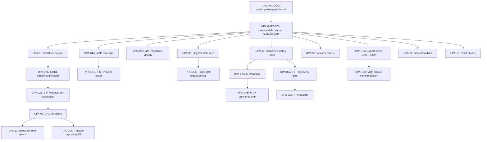

# План інтеграції upstream Sphaira після 1.0.2

Останнє оновлення: **2026-08-20**.

Джерело фактів і порівняння реалізацій:
[`upstream_audit.md`](upstream_audit.md). Цей документ не дублює повний
commit-by-commit аудит. Його призначення — перетворити висновки аудиту на
послідовні, обмежені й перевірювані задачі.

| Поле | Значення |
|---|---|
| Локальна база під час планування | `master`, `f7b10f3e406d3c427c563eb1b58cac24dc61ba8d`, Sphaira `0.13.500` |
| Upstream-база | `eeac5ff8fcffaf57d88b91d05d704e6fb0c75dba`, upstream `1.0.2` |
| Перевірений upstream HEAD | `eacb54b35548ff99057744bd94f56d67c3449fed`, 2026-08-17 |
| Обсяг аудиту | 48 upstream-комітів після бази |
| Checkout | тільки `D:\git\dev\sphaira` |
| Integration line | тільки чистий `master`, строго по одній coding task |
| Поточний стан цього документа | планування; наведені нижче зміни ще не реалізовані цим документом |
| Чинний delivery gate | `REGRESSION-VERIFY-500` у `task.md` ще hardware-pending; до першого нового code task його треба закрити або явно defer-нути з фіксацією Build ID |

## 1. Мета і межі

Мета — взяти з upstream корисну **поведінку та інваріанти**, але залишити
локальну реалізацію там, де вона краща, ширша або краще відповідає поточній
архітектурі Sphaira.

У межах плану:

- підтверджені correctness, lifetime, threading і input defects;
- частково відсутня поведінка, яка не потребує продуктового рішення;
- hardware acceptance уже реалізованих NFS і HBL affinity;
- окрема відкладена черга великих продуктових функцій.

Поза межами:

- upstream translation/i18n diffs — переклади проходять окремий локальний
  pipeline;
- upstream branding, README, release-only version bumps і merge-only commits;
- прямі cherry-pick або заміна локальних підсистем upstream-файлами;
- нові залежності, якщо чинний helper, standard library або локальний
  dependency-patch pipeline уже покриває задачу;
- продуктові зміни без окремої команди користувача.

## 2. Чому порядок саме такий

Черга визначена не датою upstream-коміту і не простотою зміни, а таким
порядком:

1. спочатку дефекти, здатні дати use-after-free, роботу зі старим файлом,
   неправильний розмір transfer або data race;
2. потім shared behavior, від якого залежать кілька transport adapters;
3. далі малі локальні UI і robustness fixes;
4. після software changes — hardware acceptance;
5. великі продуктові епіки — лише після явного вибору користувача й окремого
   design review.

Стрілки нижче показують **логічні залежності**, а не дозвіл на паралельну
роботу. Реальне виконання завжди послідовне.



## 3. Непорушний workflow для кожної coding task

### 3.1 Preflight

Перед будь-яким редагуванням виконавець запускає:

```powershell
git rev-parse --show-toplevel
git branch --show-current
git status --porcelain
git rev-parse HEAD
```

Очікується:

- root точно `D:/git/dev/sphaira`;
- branch точно `master`;
- `git status --porcelain` не виводить нічого.
- HEAD точно збігається з baseline hash, який senior записав у prompt; commit
  попередньої задачі є ancestor цього HEAD.

Якщо хоча б одна умова не виконана, задача **не починається**. Не можна
«виправляти» ситуацію через `stash`, `reset`, `restore`, `checkout`, `switch`,
`fetch`, `pull`, `merge`, `rebase`, `cherry-pick`, `clean`, remote-ref mutation,
тимчасову branch або будь-яку `git worktree` command. Треба показати
senior-рев'юеру точний стан і зупинитися.

### 3.2 Один чат — один bounded outcome

- Для кожного ID нижче senior готує окремий self-contained запит у свіжий
  Gemini chat.
- Кожен prompt містить exact baseline HEAD і `Allowed changed files`. Якщо
  потрібний інший або новий файл, junior спершу зупиняється й просить senior
  розширити scope.
- Усі корекції цієї самої задачі повертаються в той самий чат, доки senior не
  прийме diff.
- Наступний task/chat стартує лише після focused commit поточної задачі,
  перевірки, що commit є ancestor `master`, і чистого дерева.
- Якщо два task торкаються одного файла, їх не об'єднують у паралельну роботу:
  наступний бачить уже прийнятий результат попереднього.
- Якщо після preflight у shared checkout з'явився невідомий modified/untracked
  path, junior негайно зупиняється. Senior і junior не редагують primary
  checkout одночасно.

### 3.3 Розподіл відповідальності

Senior:

- повторно звіряє upstream HEAD перед стартом задачі;
- простежує локальний call flow і формулює потрібну поведінку;
- вирішує architecture, security, dependency, UX і product питання;
- переглядає повний working-tree diff та фактичні результати перевірок;
- після прийняття організовує version bump, living docs і focused commit.

Junior:

- працює лише в primary checkout і лише в межах task;
- спочатку читає всі названі callers та чинні helpers;
- реалізує найменшу root-cause зміну;
- не створює новий framework, abstraction «на майбутнє» або dependency;
- не змінює переклади, branding і сторонні функції;
- не комітить, не bump-ить version і не переписує `task.md`/`plan.md`/
  `walkthrough.md`, доки senior прямо не доручить фіналізацію;
- повертає список змінених файлів, diff summary, виконані команди та точний
  результат кожної перевірки.

### 3.4 Freeze правила під час активної задачі

Перед стартом senior перевіряє актуальний upstream HEAD. Після старту scope
цього task фіксується. Новий unrelated upstream-коміт додається до наступного
аудиту й не розширює поточну задачу. Якщо новий commit прямо змінює той самий
інваріант або спростовує вимоги task, роботу треба зупинити й оновити prompt.

Майбутні номери версій у плані навмисно не вказані: кожна прийнята зміна бере
**наступний вільний номер на момент delivery**. Інакше паралельна історія
проєкту швидко зробить заздалегідь призначені номери хибними.

### 3.5 Умови негайної зупинки

Junior зупиняється і звітує, якщо:

- checkout, branch або cleanliness не відповідають preflight;
- виявлено чужі/невідомі зміни у planned files;
- upstream і локальний call flow суттєво відрізняються від task;
- потрібна нова dependency, формат конфігурації, permission або product/UX
  рішення;
- виправлення потребує змін поза заявленим subsystem;
- dependency patch знаходить невідому або частково patched source shape;
- виник conflict;
- тест або build падає, а причина не належить очевидно до поточного diff.

У цих випадках не треба приховувати проблему workaround-ом або «прибирати»
файли. Senior має отримати exact command, output і affected paths.

## 4. Загальна черга

Позначення статусів:

- `PLANNED` — готово до формування junior prompt;
- `IN-PROGRESS` — task уже почався, але ще не прийнятий/не закомічений;
- `BLOCKED` — є конкретна зовнішня умова, без якої рух неможливий;
- `SW-DONE / HW-PENDING` — код, tests, build і commit прийняті, але немає
  реального Switch/client test;
- `DONE` — software і всі обов'язкові acceptance checks завершені;
- `PRODUCT-DEFERRED` — не починати без окремої команди користувача.

Task може бути `PLANNED` лише коли зафіксовано externally visible semantics,
error/cancel behavior, ownership boundary і acceptance result. Якщо хоч одне
рішення лишено у формі «обрати під час реалізації», статус — `BLOCKED` із
конкретним design gate; junior не приймає це рішення сам.

Позначення перевірок:

- `[AUTOMATED]` — runnable host/fixture check з однозначним exit code;
- `[MANUAL]` — code/diff inspection із записаним expected invariant;
- `[HARDWARE]` — відтворювана дія на Switch або зовнішньому client/device.

| № | ID | Пріоритет | Результат одного task | Залежить від | Ризик | Початковий статус |
|---:|---|---|---|---|---|---|
| 0a | `UPA-00-DOCS` | Gate | Зафіксований аудит і цей план; чистий `master` | — | низький | `DONE` |
| 0b | `UPA-GATE-500` | Gate | `REGRESSION-VERIFY-500` закрито або явно defer-нуто з Build ID | `UPA-00-DOCS` | hardware/baseline | `DONE` |
| 1 | `UPA-01-GHDL-OWNERSHIP` | P0 | Безпечне володіння release/asset data та selection guards | `UPA-GATE-500` | високий | `DONE (v0.13.501)` |
| 2 | `UPA-02A-GHDL-FINALIZE` | P0 | Operation identity, stale temp, cancel/error gates і success-only finalize/notify | `UPA-01-GHDL-OWNERSHIP` | високий | `DONE (v0.13.502)` |
| 3 | `UPA-02B-GHDL-DESTINATION` | P0 | ZIP type detection і safe non-ZIP default destination | `UPA-02A-GHDL-FINALIZE` | високий | `DONE (v0.13.503)` |
| 4 | `UPA-03-GHDL-URL` | P0 | Єдина мінімальна HTTP(S)/GitHub URL validation у downloader | `UPA-02B-GHDL-DESTINATION` | високий | `DONE (v0.13.504)` |
| 5 | `UPA-04A-MTP-ZERO` | P0 | Zero-byte upload у чинному libhaze pipeline | `UPA-GATE-500` | високий, hardware | `SW-DONE (v0.13.505) / HW-PENDING` |
| 6 | `UPA-05-PLAYTIME-RACE` | P0 | Worker не мутує UI-owned `m_entries` | `UPA-GATE-500` | високий | `DONE (v0.13.506)` |
| 7 | `UPA-06-HB-POLICY-WEB` | P0 | Shared mutation policy, producer inventory і повне Web success coverage | `UPA-GATE-500` | середній | `DONE (v0.13.507)` |
| 8 | `UPA-07A-HB-MTP-UPLOAD` | P0 | MTP upload/final-close використовує shared policy | `UPA-06-HB-POLICY-WEB` | високий, hardware | `DONE (v0.13.508)` |
| 9 | `UPA-07B-HB-MTP-MUTATIONS` | P0 | MTP delete/rename/directory ops використовують shared policy | `UPA-07A-HB-MTP-UPLOAD` | високий, hardware | `DONE (v0.13.509)` |
| 10 | `UPA-08A-HB-FTP-DISCOVERY` | Gate | Зафіксовані ftpsrv success seams, callback thread і patch shapes | `UPA-06-HB-POLICY-WEB` | dependency | `DONE` |
| 11 | `UPA-08B-HB-FTP` | P0 | Raw FTP upload/delete/rename використовують shared policy | `UPA-08A-HB-FTP-DISCOVERY` | високий, dependency/hardware | `DONE (v0.13.510)` |
| 12 | `UPA-04B-MTP-IDENTITY` | P1 | Versioned MTP DeviceInfo з правильною локальною product identity | `UPA-GATE-500` | product/dependency/hardware | `BLOCKED`: brand/buffer policy |
| 13 | `UPA-09-FWD-FOCUS` | P1 | Правильна touch/controller focus matrix | `UPA-GATE-500` | середній, hardware | `DONE (v0.13.511)` |
| 14 | `UPA-10A-EXPORT-NAME` | P1 | Tested usable-title/export helper і ordinary/merged NSP callers | `UPA-GATE-500` | середній | `DONE (v0.13.512)` |
| 15 | `UPA-10B-MTP-DISPLAY-NAME` | P1 | Localized UTF-8 MTP display names використовують shared title data | `UPA-10A-EXPORT-NAME` | середній | `DONE (v0.13.513)` |
| 16 | `UPA-11-GC-BARS` | P1 | Правильна theme role і safe storage ratios | `UPA-GATE-500` | низький, hardware | `DONE (v0.13.514)` |
| 17 | `UPA-12-DIRECT-ZIP-SPACE` | P1 | SD-specific destination-aware free-space preflight | `UPA-03-GHDL-URL` | architecture/behavior | `BLOCKED`: preflight seam/overwrite policy |
| 18 | `UPA-13-ROM-ALIASES` | P2 | Лише підтверджені корисні ROM database aliases | `UPA-GATE-500` | низький | `DONE (v0.13.515)` |
| 19 | `UPA-HW-NFS-449` | Acceptance | Реальний NFS smoke-test | наявний `v0.13.449` | hardware | `PLANNED` |
| 20 | `UPA-HW-HBL-452` | Acceptance | Реальний loader-affinity smoke-test | наявний `v0.13.452` | hardware | `PLANNED` |

Номери в таблиці — рекомендований **фактичний серійний порядок**. Логічно
незалежні рядки все одно не запускаються паралельно через mainline policy.
`BLOCKED` row можна пропустити лише після явного senior/user запису, що design
gate defer-нуто; це не дозвіл запускати кілька ready tasks одночасно.

## 5. Детальні task packets

### UPA-00-DOCS — зафіксувати baseline аудиту й плану

**Мета:** створити відтворювану документаційну точку перед coding changes.
Це senior-only gate: через поточні `M upstream_audit.md` і
`?? upstream_implementation_plan.md` його не можна видавати junior-у, чий
preflight правильно вимагатиме чисте дерево.

**Змінювані файли:**

- `upstream_audit.md`;
- `upstream_implementation_plan.md`.

**Потрібно:**

1. Повторно підтвердити upstream HEAD і кількість commit-ів після
   `eeac5ff8`. Якщо HEAD не змінився, очікується 48; якщо змінився, спершу
   оновити audit/plan.
2. Переконатися, що appendix аудиту має рівно один рядок для кожного commit-а
   актуального діапазону, без hard-coded припущення, що їх назавжди 48.
3. Переглянути diff обох документів.
4. Запустити `git diff --check`.
5. Після дозволу користувача створити focused docs commit без app version
   bump.
6. Перевірити порожній `git status --porcelain` і ancestry commit-а від
   `master`.

**Не робити:** code changes, build, translation sync або зміни чинного
delivery `v0.13.500`.

**Definition of done:** audit і plan знаходяться у `master`, дерево чисте,
точний commit hash записаний у handoff. Docs commit не залежить від hardware
gate, але жоден новий code task ще не стартує.

---

### UPA-GATE-500 — закрити або явно defer-нути current delivery acceptance

Це senior/user gate, не coding task і не причина затримувати `UPA-00-DOCS`.

Потрібно:

1. Закрити `REGRESSION-VERIFY-500` із `task.md` фактичним hardware result; або
2. отримати явне рішення користувача defer-нути його;
3. при defer зберегти у living docs Build ID поточного `v0.13.500` NRO:
   наступний code build змінить Build ID і не повинен змішуватися з crash
   evidence попереднього delivery.

**Definition of done:** status і Build ID однозначно зафіксовані. Лише після
цього можна видати `UPA-01` або інший новий code task.

---

### UPA-01-GHDL-OWNERSHIP — callback ownership і selection safety

**Root cause:** у `sphaira/source/ui/menus/ghdl.cpp` відкладені callbacks
зберігають reference/pointer на об'єкти з коротшим lifetime, а
`static std::vector<GhApiEntry> gh_entries` ділиться між операціями.

**Перед редагуванням прочитати:**

- весь flow від download release JSON до release popup, asset popup і
  `DownloadApp()`;
- типи `GhApiEntry`, `GhApiAsset`, `AssetEntry`;
- інші delayed popup callbacks у кодовій базі для локального ownership
  pattern.

**Потрібна поведінка:**

1. Release data належить конкретній download operation, а не global static
   state.
2. Кожен delayed callback володіє потрібними selected values або безпечним
   operation-owned container.
3. Жоден callback не тримає reference/pointer на stack object, елемент
   тимчасової closure-copy або vector, який може бути замінений.
4. Empty releases, empty assets, cancel і out-of-range selection обробляються
   до dereference.
5. Вибір optional локальної asset-конфігурації не створює nullable raw pointer
   з незрозумілим lifetime.

**Мінімальна форма:** value captures, `std::optional` і, лише якщо lifetime
popup цього вимагає, один operation-owned `std::shared_ptr<std::vector<...>>`.
Не будувати repository/session manager.

**Не входить:** download cancellation, URL validation, repo add/remove UI,
destination policy.

**Acceptance:**

- `gh_entries` більше не є static/global state;
- рев'ю кожної delayed lambda доводить lifetime всіх captures;
- порожні/скасовані choices не індексують vector;
- другий download flow не може перезаписати дані першого;
- host tests, WSL build і `git diff --check` проходять.

**Пастка для junior:** «захопити vector by value, а pointer на його елемент
залишити старим» не виправляє lifetime. Pointer має походити з того самого
owned object, який гарантовано живе до виконання callback, або бути замінений
value/optional.

---

### UPA-02A-GHDL-FINALIZE — operation identity, cancel і temp

**Root cause:** `DownloadApp()` може перейти до extraction/rename після cancel
і використати старий temp-файл.

**Потрібна поведінка:**

1. Cancel до початку network transfer завершує operation без filesystem
   mutation.
2. Cancel/error після transfer, але до install, не запускає unzip/rename і не
   сигналізує Homebrew refresh.
3. Файл попередньої операції не може бути прийнятий за результат поточної.
4. Final rename/install і `homebrew::SignalChange()` виконуються лише після
   успішного завершення поточної operation.

**Не входить:** ZIP type detection, destination policy, free-space preflight,
URL validation і repo management UI.

**Acceptance cases:**

- [AUTOMATED або isolated fixture] failed download при наявному старому
  temp-файлі не може перейти до finalize;
- [MANUAL] рев'ю phase gates: cancel до curl, cancel під час/відразу після curl;
- [HARDWARE] canceled/failed operation не встановлює файл і не дає catalog
  refresh; успішна operation finalize-иться рівно один раз.

**Пастка для junior:** перевірка `ShouldExit()` лише всередині curl callback
недостатня. Потрібні чіткі gates між фазами
`download → inspect/extract → finalize → notify`.

---

### UPA-02B-GHDL-DESTINATION — ZIP type і safe non-ZIP destination

**Залежність:** lifecycle/finalization із `UPA-02A` уже прийнятий.

**Потрібна поведінка:**

1. ZIP визначається для підтриманих entry types за content type та
   case-insensitive extension URL path/asset name; query string не є частиною
   extension.
2. ZIP flow продовжує використовувати hardened shared
   `thread::TransferUnzipAll()`.
3. Non-ZIP asset без explicit `entry.path` отримує
   `/switch/<sanitized-asset-name>`, а не root `/`.
4. Explicit destination лишається сумісним, але проходить чинні path/bounds
   guards.
5. Empty/unsafe asset basename відхиляється до filesystem mutation.

**Не входить:** URL parser, free-space preflight або repository UI.

**Acceptance:**

- [AUTOMATED] ZIP extension: `.zip`/`.ZIP`, URL query, non-ZIP і empty basename;
- [MANUAL] code review доводить, що shared ZIP validation не дублюється;
- [HARDWARE] standalone `.nro` без path потрапляє у безпечний `/switch`
  destination, ZIP успішно розпаковується, explicit valid path не регресує.

---

### UPA-03-GHDL-URL — централізована URL validation

**Мета:** malformed або небезпечна адреса відхиляється до network і path
operations у всіх чинних GitHub/direct download entry paths.

**Перед редагуванням:**

- знайти всі callers, що формують GitHub API URL або приймають direct URL;
- перевірити, чи `web_http.hpp/.cpp` або чинний curl helper уже має потрібний
  parser; повторно його не реалізовувати;
- порівняти семантику upstream URL normalization, але не копіювати management
  UI.

**Зафіксована URL policy:**

| Input type | Accept | Reject/normalize |
|---|---|---|
| GitHub repository URL | `http://github.com/owner/repo` або `https://github.com/owner/repo` | Normalized API transport завжди HTTPS; один trailing slash і `.git` suffix забираються |
| GitHub repository URL | owner/repo segments з ASCII letters, digits, `-`, `_`, `.` | Reject empty segment, extra path component, userinfo, port, query, fragment і percent-encoded path |
| Direct asset URL | explicit HTTP/HTTPS, non-empty host, optional port, valid path/query/percent encoding | Reject other scheme, userinfo, empty host, malformed percent encoding і fragment |
| Direct ZIP prompt | valid direct URL, а URL **path** закінчується case-insensitive `.zip` | Query дозволений і не бере участі в extension check |

Перед реалізацією senior перевіряє чинні built-in/custom JSON entries. Якщо
реальний сумісний entry порушує таблицю, task зупиняється для вузького
задокументованого винятку; junior не послаблює policy сам.

**Потрібна поведінка:**

- GitHub repository form не індексується через blind prefix/substr arithmetic;
- owner/repository або direct URL перевіряються до створення API URL;
- одна й та сама validation використовується built-in JSON catalogs і
  file-based custom repository entries;
- error path не мутує config і не запускає download.

**Не входить:** UI add/remove, transactional persistence, новий generic URL
framework або підтримка інших schemes.

**Acceptance:** [AUTOMATED] один малий host-test для кожного рядка policy
table: valid HTTP/HTTPS, empty host, wrong scheme, credentials, port, query,
fragment, malformed GitHub path, `.git`, trailing slash, percent encoding і
direct archive URL. Також `tests/run.sh`, WSL build і `git diff --check`.

---

### UPA-04A-MTP-ZERO — zero-byte upload

**Root cause:** локальний libhaze patch уже resize-ить buffer до фактичного
read, але умова `data_header.length > sizeof(PtpUsbBulkContainer)` не приймає
payload рівно нуль байтів; transfer лишає dummy `4_GB`.

**Змінювати насамперед:**

- `sphaira/cmake/patch_libhaze.cmake`;
- `sphaira/CMakeLists.txt` лише якщо це потрібно чинному patch test/configure
  path.

**Потрібно:**

1. Додати лише відсутню семантику `>=` для zero-byte payload.
2. Зберегти всі локальні progress, signed-size, storage-ID, property та UTF
   patches.
3. Розширити чинний idempotent shape-checked CMake script: original shape
   patch-иться, already-patched shape приймається, unknown/partial shape
   завершує configure з чіткою помилкою.
4. Не додавати upstream raw `.patch` поруч із чинним pipeline.

**Patch-shape check:** повторний configure доводить тільки already-patched
path. Task має лишити один ізольований runnable fixture/check, що окремо
перевіряє:

- original pinned-source shape успішно patch-иться;
- already-patched shape є no-op;
- partial/unknown shape завершується очікуваною помилкою.

**Software verification:**

```powershell
wsl bash -l -c "cd /mnt/d/git/dev/sphaira && tests/run.sh"
wsl bash -l -c "cd /mnt/d/git/dev/sphaira && cmake --preset ReleaseWithInstall"
wsl bash -l -c "cd /mnt/d/git/dev/sphaira && cmake --preset ReleaseWithInstall"
wsl bash -l -c "cd /mnt/d/git/dev/sphaira && cmake --build --preset ReleaseWithInstall --parallel 16"
git diff --check
```

Другий configure потрібний, щоб довести idempotency patch script.

**Hardware acceptance:**

- Windows MTP client: створити 0-byte file і повторно замінити його 0-byte
  file;
- щонайменше один Android/Linux MTP client, якщо доступний;
- size після reconnect дорівнює 0;
- звичайний non-empty upload не регресує.

**Статус:** commit можна позначити `SW-DONE / HW-PENDING` після software
verification, але не `DONE` без hardware matrix.

---

### UPA-04B-MTP-IDENTITY — versioned DeviceInfo

**Статус:** `BLOCKED` до senior/product рішення. Локальний NRO metadata brand —
`Kefir Hub`, тоді як чинний HTTP User-Agent і upstream protocol string —
`Sphaira`. Junior не обирає literal сам.

**Design gate перед prompt:**

1. Зафіксувати protocol identity literal: local product `Kefir Hub` або
   compatibility identity `Sphaira`, із короткою причиною.
2. Використати чинне джерело app version
   (`sphaira_VERSION`/`APP_VERSION`), не дубльовану константу.
3. Зафіксувати maximum field/buffer length із libhaze API, NUL termination і
   UTF conversion.
4. Якщо HOS version query не вдався, responder не падає: fallback —
   `<product>/<app-version> (HOS/unknown)`.

**Потрібний результат після розблокування:** DeviceInfo містить
`<product>/<app-version> (HOS/<firmware>)`, де brand відповідає рішенню вище;
formatting не переповнює field, а unknown firmware має deterministic fallback.

**Acceptance:**

- [AUTOMATED] exact normal/fallback formatting і boundary length;
- [MANUAL] dependency macro/source та NUL termination review;
- [HARDWARE] Windows/Android DeviceInfo показує правильні product/application,
  app-version і HOS-version values.

---

### UPA-05-PLAYTIME-RACE — UI-thread apply

**Root cause:** callback `ProgressBox` працює у worker thread, а
`Menu::LoadPlaytime()` напряму змінює UI-owned `m_entries`.

**Перед редагуванням:**

- прочитати `ProgressBox` constructor/destructor/update і точне місце запуску
  done callback;
- простежити lifetime `game_menu::Menu` та локальний WeakPtr pattern;
- знайти всі readers/sorters `m_entries`.

**Потрібна поведінка:**

1. Worker читає PDM/playlog і формує окремий result buffer, не торкаючись
   `m_entries`.
2. Після завершення/join results застосовуються на UI thread через чинний done
   mechanism.
3. Якщо menu більше не існує, apply безпечно пропускається.
4. Cache writes і progress залишаються функціонально сумісними.
5. Після apply поточний sort/view оновлюється один раз, а не на кожен title.
6. UI застосовує весь result buffer лише при `R_SUCCEEDED(rc)`. При cancel/error
   in-memory results повністю відкидаються.
7. Чинні per-title cache writes можуть лишитися як дозволена partial-cache
   policy: вони не змінюють поточний UI, але можуть бути прочитані наступним
   повним scan.
8. `ProgressBoxDoneCallback` зараз виконується в destructor після join на
   UI/widget-stack thread. Junior підтверджує цей call path; якщо він змінився,
   task зупиняється замість вибору нового dispatch mechanism.

**Не входить:** silent selected-title worker, privacy toggle, повний upstream
threading model або global mutex навколо menu.

**Acceptance:**

- [MANUAL] статичне рев'ю підтверджує відсутність worker writes до
  `m_entries`;
- [MANUAL] cancel/error не застосовує result buffer до current UI; partial cache
  не викликає UI mutation;
- [MANUAL] WeakPtr/lifetime path не лишає dangling `this`;
- [AUTOMATED] host tests, WSL build, `git diff --check`;
- [HARDWARE] Switch smoke-test: successful bulk refresh, cancel із discard,
  зміна sort і вихід із menu до/після завершення modal.

---

### UPA-06-HB-POLICY-WEB — shared mutation policy і Web adapter

**Мета epic `UPA-06..08B`:** після будь-якої успішної зовнішньої мутації, яка
може змінити Homebrew catalog, menu отримує один completion signal незалежно
від transport.

**Shared policy має враховувати:**

- default root `/switch`;
- configured roots через чинний `homebrew::GetSearchPaths()`, без дублювання
  INI parser;
- component-boundary path matching: `/switch2` не є дочірнім `/switch`;
- case-insensitive `.nro` suffix;
- file create/upload сигналить лише після повного успішного close/finalize;
- file delete/rename/move сигналить після успіху, якщо old або new path
  впливає на catalog;
- directory delete/rename/move всередині monitored root теж сигналить, бо
  каталог міг містити NRO;
- failed або canceled operation не сигналить;
- NFS read-only browse/read ніколи не сигналить.

**Task UPA-06 scope:**

1. Перед реалізацією скласти inventory всіх current producers
   `homebrew::SignalChange()` і всіх writable ingress paths, здатних створити,
   замінити, перейменувати або видалити file/directory під Homebrew roots:
   GitHub/GHDL, AppStore/background install, Web, MTP, FTP і generic
   file-transfer paths із writable external mounts.
2. Кожен producer перевести на shared policy або явно задокументувати як
   read-only, non-catalog-affecting чи свідомо дозволений unconditional full
   refresh.
3. Додати мінімальний predicate/notifier поруч із чинним
   `homebrew::SignalChange()`.
4. Перевести на нього Web upload.
5. Додати відсутній Web delete coverage після успішного видалення file/folder.
6. Не сигналити на кожен write chunk і не робити full rescan у network thread:
   notifier лише будить чинний catalog refresh mechanism.

Transport adapter повідомляє лише про успішно завершену mutation і передає
фактичний destination path або conservative destination scope. Саме shared
policy, а не transport, вирішує, чи operation перетинає default/custom roots.

**Тести:** малий host-test для path policy: default/custom root, prefix trap,
uppercase `.NRO`, unrelated path, file rename into/out of root, directory
rename/delete. Далі `tests/run.sh`, WSL build, `git diff --check`.

**Hardware/Web acceptance:** upload/delete NRO у default і custom root,
unrelated file без refresh, canceled upload без refresh.

---

### UPA-07A-HB-MTP-UPLOAD — MTP upload/final close

**Залежність:** використовувати policy з `UPA-06`; не створювати MTP-specific
duplicate path logic.

**Перед редагуванням:** простежити virtual MTP path, `RoutePath()/FixPath()`,
redirected root upload і момент успішного `CloseFile` у
`sphaira/source/haze_helper.cpp`.

**Потрібна поведінка цього task:**

- upload/create: signal один раз після successful final close, а не після
  `CreateFile` чи кожного `WriteFile`;
- не змінювати read-only MTP Games, installer proxy або MTP Saves semantics;
- failed redirected upload не залишає false refresh.

**Acceptance:**

- [MANUAL] routed destination, close success і exactly-once notify review;
- [HARDWARE] Windows MTP upload у `/switch` і custom root, unrelated upload,
  failed/canceled upload і reconnect.

---

### UPA-07B-HB-MTP-MUTATIONS — MTP delete/rename/directory operations

**Залежність:** upload path `UPA-07A` уже прийнятий.

**Потрібна поведінка:**

- delete: signal після successful underlying delete;
- rename/move: оцінити old і new routed destination після successful rename;
- directory delete/rename у monitored root також покривається;
- failed operation не сигналить;
- read-only MTP Games, installer proxy та MTP Saves semantics не змінюються.

**Acceptance:**

- [AUTOMATED] shared path-policy cases вже покривають old/new paths і
  directories;
- [MANUAL] усі MTP mutation return paths сигналять тільки після success;
- [HARDWARE] Windows MTP delete/rename у `/switch` і custom root, rename into/
  out of root, unrelated path і failed operation.

---

### UPA-08A-HB-FTP-DISCOVERY — senior-only ftpsrv gate

**Статус:** `DONE` (дизайн та точки інтеграції зафіксовано).

**Зафіксовані результати дослідження:**

1. **Точні ftpsrv source functions з остаточним success result (`src/platform/nx/vfs/vfs_nx_fs.c`)**:
   - `vfs_fs_close()` — після `vfs_fs_internal_close()` для файлів з `is_write = true` (успішне закриття після завершення upload/write);
   - `vfs_fs_unlink()` — після `vfs_fs_internal_unlink()` повертає `0` (успішне видалення файлу);
   - `vfs_fs_rmdir()` — після `vfs_fs_internal_rmdir()` повертає `0` (успішне видалення каталогу);
   - `vfs_fs_mkdir()` — після `vfs_fs_internal_mkdir()` повертає `0` (успішне створення каталогу);
   - `vfs_fs_rename()` — після `vfs_fs_internal_rename()` повертає `0` (успішне перейменування/переміщення файлу або каталогу).
   Усі функції отримують вже нормалізований `nxpath` (наприклад, `/switch/app.nro`) через `fsdev_wrapTranslatePath`.
2. **Callback thread & thread safety**:
   - Колбек викликається на ftpsrv worker thread (`g_thread`).
   - Сповіщення через `homebrew::Notify*` та `homebrew::SignalChange()` (`ueventSignal(&g_change_uevent)`) є повністю thread-safe (kernel event signal) та не викликає блокувань чи гонитви.
3. **Патч-маркери у `sphaira/cmake/patch_ftpsrv.cmake`**:
   - Чинні маркери: `sphaira: anonymous access`, `sphaira: restrict which root devices`, `sphaira: optional allowlist of visible root`, `sphaira: claim writes to the server root`, `sphaira: root-drop routing`.
   - Новий маркер для `UPA-08B`: `sphaira: filesystem mutation notifications`.
4. **Мінімальний C ABI між ftpsrv та `ftpsrv_helper.cpp`**:
   - У `vfs_nx.h`:
     ```c
     typedef enum VfsNxMutation {
         VFS_NX_MUTATION_FILE_CREATED = 0,
         VFS_NX_MUTATION_FILE_DELETED = 1,
         VFS_NX_MUTATION_DIR_CREATED  = 2,
         VFS_NX_MUTATION_DIR_DELETED  = 3,
         VFS_NX_MUTATION_RENAME_FILE  = 4,
         VFS_NX_MUTATION_RENAME_DIR   = 5,
     } VfsNxMutation;
     typedef void (*vfs_nx_mutation_cb)(VfsNxMutation type, const char* path1, const char* path2);
     void vfs_nx_set_mutation_callback(vfs_nx_mutation_cb cb);
     ```
   - У `sphaira/source/ftpsrv_helper.cpp`: реєстрація `FtpMutationCallback(VfsNxMutation type, const char* p1, const char* p2)` і виклик відповідних методів `ui::menu::homebrew::Notify*`.
5. **Allowed changed files для `UPA-08B`**:
   - `sphaira/cmake/patch_ftpsrv.cmake`
   - `sphaira/source/ftpsrv_helper.cpp`
   - `tests/test_patch_ftpsrv.sh`
   - `tests/run.sh`
   - `sphaira/CMakeLists.txt`
   - Документація (`upstream_audit.md`, `upstream_implementation_plan.md`, `task.md`, `plan.md`, `walkthrough.md`).

---

### UPA-08B-HB-FTP — raw FTP adapter

**Технічна залежність:** shared policy `UPA-06` і discovery `UPA-08A`.
`UPA-07A/B` не є технічною передумовою; їхній попередній номер — лише
операційний серійний порядок.

**Перед редагуванням:**

- прочитати чинний `sphaira/cmake/patch_ftpsrv.cmake`;
- звірити exact seams/thread/patch markers із прийнятим `UPA-08A`.

**Потрібна поведінка:**

1. Під'єднати project-owned success callback для upload/delete/rename, а не
   вгадувати успіх із log/progress messages.
2. Передавати path у shared policy; dependency не повинна напряму знати про UI
   або custom roots.
3. Якщо dependency patch потрібний, розширити чинний idempotent
   `patch_ftpsrv.cmake` з original/already-patched/unknown-shape guards.
4. Зберегти anonymous login, device allowlist і root-drop router patches.
5. Не переносити upstream suffix-only callback як фінальну policy.

**Patch-shape verification:** повторний configure доводить лише
already-patched path. Ізольований runnable fixture/check має окремо довести
original, already-patched і partial/unknown failure shapes.

**Software verification:** host tests, configure, повторний configure/shape
checks, WSL build і `git diff --check`.

**Hardware acceptance matrix:**

| Transport operation | `/switch` | custom root | unrelated path | Очікування |
|---|---:|---:|---:|---|
| Upload `.nro` | так | так | так | refresh лише для monitored path після success |
| Delete `.nro` | так | так | так | те саме |
| Rename/move `.nro` | так | так | так | old або new monitored path викликає refresh |
| Failed/canceled operation | так | так | так | refresh відсутній |

Epic cross-source completion вважається `DONE` лише після inventory всіх
writable external sources, перевірки вже наявних GitHub/AppStore/background
install paths і Web/MTP/FTP matrix. Кожне виключене джерело має явну причину:
read-only, не може змінювати Homebrew catalog або використовує той самий уже
покритий shared mutation path. NFS виключений саме як read-only source.

---

### UPA-09-FWD-FOCUS — Forwarder editor touch/controller matrix

**Root cause:** unconditional return при `m_icon_focused` у
`sphaira/source/ui/forwarder_editor.cpp` не дає touch події дійти до правого
`List::OnUpdate()`.

**Потрібна поведінка:**

- touch правого list працює незалежно від попереднього icon/title focus;
- controller RIGHT лише переносить focus у list і не активує row тією самою
  подією;
- controller LEFT повертає focus очікувано;
- touch activation list row очищує left/icon focus;
- `A` діє лише на поточно сфокусований control;
- scroll і tap не породжують подвійної activation.

**Не входить:** заміна локального picker/crop editor, layout redesign або нові
настройки forwarder.

**HARDWARE acceptance matrix:**

| Initial state | Event | Expected result |
|---|---|---|
| icon focused | tap list row | list отримує focus; row activation рівно 1 |
| icon focused | drag/scroll list | list scroll змінюється; activation 0 |
| icon focused | RIGHT | list отримує focus; activation 0 |
| list focused | LEFT | icon отримує focus; activation 0 |
| list focused | A | selected row activation рівно 1 |
| icon focused | A | icon action рівно 1; list activation 0 |
| list focused після touch | повторний tap | activation рівно 1, без double-fire |

[AUTOMATED] host tests, WSL build і `git diff --check` також обов'язкові.

---

### UPA-10A-EXPORT-NAME — usable-title core і NSP exports

**Перед редагуванням прочитати:**

- `sphaira/include/nacp_util.hpp`;
- `sphaira/source/title_info.cpp`;
- `sphaira/source/title_nsp.cpp`;
- усі callers, що додають mandatory Title-ID suffix.

**Інваріанти:**

1. NACP English entries беруться через local `nacp_util` і правильні фізичні
   slots 0/1; `SetLanguage` enum не використовується як array index.
2. Для ASCII-safe NSP export порядок candidate-ів:
   American/British English → localized/current → Title ID.
   Це свідомо зафіксована policy для portable ASCII filesystem export; MTP
   localized display у `UPA-10B` має інший порядок.
3. Candidate оцінюється **після** sanitization. Порожній рядок або рядок, усі
   символи якого належать множині `{space, '.', '_'}`, непридатний. Інші
   символи не відхиляються без окремого правила й тесту.
4. Truncation лишає місце для mandatory Title-ID suffix/NUL.
5. Однаковий input дає deterministic output; suffix запобігає collisions.
6. English/localized NACP candidates читаються не більше одного разу на title
   під час побудови export metadata й повторно використовуються ordinary та
   merged NSP callers; caller-и не перечитують той самий control NCA.

**Мінімальна реалізація:** reuse local sanitizers і NACP adapter; один простий
usable-title/export helper. Не вводити generic naming policy object, Unicode
toggle або MTP migration у цей task.

**Обов'язкові host cases:**

- English slot 0;
- fallback на slot 1;
- English порожній, localized usable;
- localized sanitization дає empty/`___`/`...`;
- усі назви порожні → Title ID;
- maximum-length name із збереженим suffix;
- normal ASCII name не змінюється без потреби.

Після tests — WSL build і `git diff --check`.

---

### UPA-10B-MTP-DISPLAY-NAME — localized UTF-8 MTP naming

**Залежність:** `UPA-10A` уже дає один набір title candidates/usable
semantics; не перечитувати control NCA в MTP caller.

**Потрібна поведінка:**

1. MTP display order: localized/current → American English → British English →
   Title ID.
2. Display name зберігає Unicode; ASCII sanitizer з NSP export тут не
   застосовується.
3. UTF-8 truncation не розриває code point і завжди лишає місце для mandatory
   Title-ID suffix/NUL.
4. Empty або unusable localized candidate переходить до English, далі Title ID.
5. Звичайний і merged NSP export з `UPA-10A` не змінюються.

**Acceptance:**

- [AUTOMATED] Cyrillic, emoji, boundary truncation, empty localized,
  English fallback, Title-ID fallback і suffix collision cases;
- [MANUAL] title metadata читається один раз і повторно використовується;
- [HARDWARE] Windows/Android MTP показує valid UTF-8 localized folder names.

---

### UPA-11-GC-BARS — GameCard theme і safe ratio

**Scope:** тільки GameCard storage bars у
`sphaira/source/ui/menus/gc_menu.cpp` та мінімальні тести/helper, якщо вони
природно існують.

**Потрібно:**

- два track/background draw calls використовують
  `ThemeEntryID_PROGRESSBAR_BACKGROUND`;
- fill theme roles і багатший local `MenuBase` storage UI не змінюються;
- перед query всі чотири size fields обнуляються;
- якщо `total > 0`, `free = clamp(free, 0, total)` і
  `used_ratio = (total - free) / total`;
- якщо query failed або `total <= 0`, `used_ratio = 0`: track лишається
  видимим, fill має нульову ширину, existing label показує `0.00 GB`;
- division by zero, NaN і bar поза bounds неможливі.

**Acceptance:** [AUTOMATED] ratio helper cases `total=0`, `free<0`,
`free>total` і normal; [HARDWARE] normal theme, image-background theme,
failed/zero storage query і normal GameCard query; host tests, WSL build,
`git diff --check`.

---

### UPA-12-DIRECT-ZIP-SPACE — destination-aware SD preflight

**Залежність:** `UPA-01-GHDL-OWNERSHIP`,
`UPA-02A-GHDL-FINALIZE`, `UPA-02B-GHDL-DESTINATION` і
`UPA-03-GHDL-URL` уже прийняті.

**Статус:** `BLOCKED`. До junior prompt senior має зафіксувати:

1. API seam, через який SD-specific caller отримує validated
   `total_uncompressed_size` до першої mutation.
2. Одну overwrite policy: conservative full uncompressed size або exact
   net-growth із розмірами existing destination files.
3. Safety margin, exact insufficient-space Result/error UX і expected result
   для empty archive.

Junior не обирає ці semantics або API seam.

**Мета:** до першої filesystem mutation direct ZIP install перевіряє, що
конкретний SD destination має достатньо місця.

**Важливе розмежування:**

- shared `thread::TransferUnzipAll()` лишається filesystem-agnostic і зберігає
  path/size/overflow hardening;
- SD free-space query належить SD-specific caller/wrapper;
- compressed archive size не є required uncompressed size;
- overwrite existing files може змінювати net required space, тому policy має
  бути явно визначена й не використовувати unchecked arithmetic.

**Потрібна поведінка:**

1. Archive повністю проходить read-only validation/sizing до створення files/
   directories.
2. Total і destination arithmetic мають overflow guards.
3. Недостатнє місце повертає зрозумілу помилку до extraction.
4. Non-SD destinations і unrelated shared unzip callers не отримують
   SD-specific assumption.
5. Existing-file overwrite policy задокументована тестом: conservative reject
   або exact net-growth — відповідно до senior-рішення design gate.

Не створювати окремий GHDL validator для archive path/name/overflow rules.
Read-only sizing/preflight має перевикористати або мінімально винести чинний
first validation pass із `TransferUnzipAll()`. Shared layer лишається власником
path safety, filename bounds, joined-path bounds та integer-overflow checks;
SD-specific caller додає тільки free-space policy.

**Acceptance cases:** enough space, insufficient space, empty archive,
overflow metadata, existing destination files, nested paths, cancel до
extraction. Host test для pure size decision, WSL build, Switch direct-ZIP
smoke-test.

---

### UPA-13-ROM-ALIASES — тільки реально підтримані database names

**Мета:** додати compatibility aliases із `0882439` без мертвої конфігурації.

**Перед зміною:** перевірити assets/association databases і реальні directory
names для:

- `NEC - PC Engine SuperGrafx`;
- `Nintendo - Family Computer Disk System` поряд із чинним Famicom name;
- base `SNK - Neo Geo` поряд із Pocket/Color/CD.

**Потрібно:** додати alias у central map
`sphaira/include/ui/menus/filebrowser_assoc.hpp` лише коли відповідний database
target реально існує або вже підтримується resolver-ом.

**Не робити:** перейменування чинних user directories, видалення старих aliases
або новий database loader.

**Acceptance:** existing aliases не регресують; кожен новий directory
резолвиться у правильну database; якщо target відсутній, task зупиняється зі
звітом замість додавання dead mapping. Далі host tests, WSL build,
`git diff --check`.

## 6. Hardware acceptance уже реалізованих функцій

`UPA-HW-*` — acceptance runs, а не coding tasks. Вони не потребують Gemini
implementation workflow, app-version bump або code diff. Evidence/status
оновлюється у чинних audit/task/walkthrough документах; focused docs commit
створюється лише якщо документацію фактично змінено. Якщо run виявив дефект,
fix оформлюється як нова окрема coding task. Якщо device недоступний, статус
лишається `HW-PENDING`, не `PASS`.

### UPA-HW-NFS-449

Перед тестом зафіксувати URL, server implementation і network topology.

1. Підключити nested export на зразок
   `nfs://server/export/media/subdirectory`.
2. Browse root і вкладені каталоги.
3. Відкрити known-content файли розміром 4 KiB і щонайменше 256 MiB.
4. Copy обох файлів з NFS на SD; порівняти exact byte size і SHA-256 із source.
5. Виконати 3 повні disconnect/reconnect cycles і після кожного відкрити 4 KiB
   файл.
6. Переконатися, що create/upload/delete/rename actions відсутні або
   повертають read-only error.
7. Переконатися, що NFS browse/read не викликає Homebrew mutation refresh.

Результат записати як `HW-NFS-449 PASS/FAIL` із firmware, server і точним
failure step, двома sizes/hashes та результатом кожного з 3 reconnect cycles.

### UPA-HW-HBL-452

1. В Application mode виконати 10 послідовних normal NRO launches із
   поверненням до Sphaira/Kefir Hub.
2. В Application mode виконати 10 chain/return cycles через
   `envSetNextLoad()`.
3. В Applet mode, якщо цей delivery його підтримує, виконати 5 normal launches
   і 5 `envSetNextLoad()` cycles; якщо не підтримує — записати `N/A` із
   конкретною причиною.
4. Для кожного доступного process core mask записати observed mask.
5. За наявності diagnostic log підтвердити, що перед trampoline повернуто
   фактичну process mask.
6. Перевірити відсутність hang/black screen під час першого та повторного
   launch.

Результат записати як `HW-HBL-AFFINITY-452 PASS/FAIL` із firmware, launch
sequence, підсумком `10+10` Application та `5+5` Applet/N/A і логом.

## 7. Великі продуктові епіки — не видавати junior без design gate

Ці пункти є реальними upstream-функціями або розширеннями, але не є готовими
engineering fixes. Для кожного спершу потрібна окрема команда користувача,
короткий product/design документ і тільки потім декомпозиція на coding tasks.

| Рекомендований порядок | Epic | Передумова | Чому не можна одразу «скопіювати upstream» |
|---:|---|---|---|
| 1 | MTP folder installation | `UPA-04A-MTP-ZERO` і стабільний current MTP | Локальний `FsInstallProxy`, Unicode, storage IDs і properties значно розширені; треба адаптувати nested path tree до current API |
| 2 | Update/DLC catalog + missing/stale filter | Вибір remote source/cache policy | Зовнішній catalog впливає на network trust, stale state, UX і failure behavior |
| 3 | Generic Screensaver coverage | Перелік long-running `ProgressBox` flows | Локальний Screensaver уже кращий; треба лише розширити coverage без другої backlight lifecycle системи |
| 4 | Custom repository add/remove UI | `UPA-01`, `UPA-02A/B`, `UPA-03` | Потрібні transactional persistence, dedup і recovery; downloader correctness має бути стабільним раніше |
| 5 | Play-stat privacy toggle / selected worker | `UPA-05-PLAYTIME-RACE` | Потрібне рішення про default, privacy, PDM I/O і видимість sort/filter |
| 6 | Керована 3/4-core forwarder model | Закритий `UPA-HW-HBL-452` | Вимагає permissions, relaunch, rollback, warnings і hardware matrix |
| 7 | MSP package installer | Окремий threat/rollback design | Parser hardening уже є; відсутній небезпечніший product layer зі staging і записом Atmosphère content |

### 7.1 MTP folder installation

До junior prompt senior має визначити:

- virtual path model і case-insensitive collision policy;
- які extensions інсталюються, а які ігноруються;
- create/delete/rename directory semantics;
- session reset і handle lifetime;
- progress totals для nested tree;
- cleanup після cancel/error;
- Windows/Android client matrix.

Рекомендована декомпозиція після approval:

1. read-only path tree та unit-tested normalization;
2. directory operations і handle/session ownership;
3. nested install aggregation;
4. cancel/rollback;
5. hardware acceptance.

### 7.2 Update/DLC checker і filter

До junior prompt визначити:

- canonical catalog URL і trust/fallback policy;
- cache location, TTL, schema version і stale indicator;
- comparison rules для base/update/DLC;
- offline behavior;
- чи filter показує missing, stale або обидва;
- privacy/network opt-in.

Checker і Game Menu filter — один epic, але щонайменше два послідовні
deliveries: спочатку catalog/cache/comparison core з host tests, потім UI.

### 7.3 Generic Screensaver coverage

Потрібно перевикористати чинний local `Screensaver` та його refcounted no-sleep,
OLED/brightness restore і timeout. Не переносити upstream LBL lifecycle.

Спершу скласти повний список довгих flows, потім підключити один shared
`ProgressBox` lifecycle point, якщо всі callers справді проходять через нього.
Якщо частина flows має інший lifecycle, додати лише тонкі adapters.

### 7.4 Custom repository management UI

Після downloader hardening визначити:

- atomic write/rollback config;
- normalized identity і dedup;
- built-in entries, які не можна випадково видалити;
- validation/error UX;
- recovery з malformed JSON.

File-based custom repos мають лишитися сумісними. UI не повинен створювати
другий формат persistence.

### 7.5 Play-stat toggle і selected-title worker

Спочатку вирішити:

- default on/off;
- чи toggle блокує лише нові PDM reads або також ховає cache/sorts;
- чи existing cache видаляється;
- коли запускається selected worker;
- cancellation і lifetime selected menu item.

Після `UPA-05-PLAYTIME-RACE` worker-owned result/UI-thread apply є обов'язковим
pattern.

### 7.6 Керована 3/4-core модель

Не переносити окремі upstream fragments. Epic має разом покрити:

- permission model;
- current/desired mask detection;
- no-op, коли mask уже правильна;
- relaunch і rollback;
- explicit warning для 4 cores;
- forwarder persistence;
- HBL restore перед trampoline;
- hardware matrix для applet/application modes.

### 7.7 MSP installer

Це останній за рекомендованим ризиковим порядком epic. До коду потрібні:

- manifest schema і bounds;
- дозволені destinations;
- path traversal/device injection protection;
- staging;
- atomic commit/rollback;
- cleanup після crash/cancel;
- conflict policy;
- signature/trust expectations;
- transport coverage.

Не створювати другий PFS0/NSP parser: чинний hardened parser треба
перевикористати.

## 8. Загальна verification matrix

### Для кожної нетривіальної software task

```powershell
wsl bash -l -c "cd /mnt/d/git/dev/sphaira && tests/run.sh"
wsl bash -l -c "cd /mnt/d/git/dev/sphaira && cmake --preset ReleaseWithInstall"
wsl bash -l -c "cd /mnt/d/git/dev/sphaira && cmake --build --preset ReleaseWithInstall --parallel 16"
git diff --check
```

Якщо змінено CMake dependency patch, порядок такий:

```powershell
# isolated original/already-patched/partial-or-unknown fixture checks
wsl bash -l -c "cd /mnt/d/git/dev/sphaira && cmake --preset ReleaseWithInstall"
wsl bash -l -c "cd /mnt/d/git/dev/sphaira && cmake --preset ReleaseWithInstall"
wsl bash -l -c "cd /mnt/d/git/dev/sphaira && cmake --build --preset ReleaseWithInstall --parallel 16"
```

Не треба видаляти build directory для «чистоти» без окремої потреби й дозволу.
Повторний configure доводить лише already-patched path. Original і
partial/unknown shapes доводяться isolated fixture/check; не заявляти їх
покритими тільки через повторний configure.

### Що записувати у звіт junior

- root, branch і preflight status;
- початковий HEAD;
- змінені файли;
- короткий опис root cause і обраного найменшого fix;
- що свідомо не змінювалося;
- exact commands;
- exit code і суттєвий output кожної перевірки;
- hardware checks, які фізично не могли бути виконані;
- фінальний `git diff --stat`, `git diff --check` і `git status --short`.

Фраза «має працювати» не є verification. Якщо команда не запускалася, треба
написати `not run` і причину.

## 9. Senior review checklist

Перед прийняттям кожної реалізації senior перевіряє:

### Scope

- diff містить лише expected files;
- немає translation/branding/release noise;
- немає worktree, branch, stash або unrelated cleanup;
- upstream code не скопійовано поверх кращої local subsystem.

### Correctness

- виправлено root cause у найнижчій спільній доречній точці;
- простежено всіх callers зміненого helper/API;
- lifetime delayed callbacks доведений;
- UI-owned state змінюється лише на правильному thread;
- success callbacks викликаються після success, не на attempt;
- cancel/error не переходить до finalize;
- path, size та integer boundaries перевірені.

### Simplicity

- використано чинний helper/pipeline;
- немає abstraction з одним speculative consumer;
- немає duplicate URL/path/parser/patch framework;
- fewest-file diff не досягнутий ціною пропущеного sibling caller.

### Verification і delivery

- для deterministic host-testable defect regression check справді падав би без
  fix; для hardware-only input/transport defect достатні documented static
  proof і точна manual/hardware matrix;
- `tests/run.sh` і WSL `ReleaseWithInstall` пройдені;
- dependency patches повторно configure-яться;
- `git diff --check` чистий;
- hardware gate явно `PASS` або `HW-PENDING`;
- app version піднято до наступної доступної лише після прийняття;
- `task.md`, `plan.md` і `walkthrough.md` оновлено для конкретного delivery;
- після version/docs finalization ще раз переглянуто повний diff, запущено
  `git diff --check` і `git status --short`; оскільки version входить у binary,
  повторно виконано configure/build із фінальною версією;
- focused commit створено у primary `master`;
- після commit:

```powershell
git merge-base --is-ancestor <task-commit> master
git status --porcelain
```

Перша команда має exit code 0, друга — порожній output.

## 10. Шаблон запиту для нового Gemini chat

Senior заповнює цей шаблон даними одного ID, не вставляючи весь backlog:

```text
Ти junior-виконавець одного bounded task у Sphaira.

Repository:
- Працюй тільки в D:\git\dev\sphaira.
- Branch має бути master.
- Worktree має бути чистим.
- HEAD має точно дорівнювати <baseline hash from senior prompt>.
- Commit <previous task commit> має бути ancestor поточного HEAD.
- Не запускай fetch/pull/merge/rebase/cherry-pick/clean.
- Не створюй branch/worktree і не використовуй stash/reset/restore/checkout/switch.
- Не запускай жодних git worktree commands і не змінюй remote refs.
- Якщо preflight не збігається — зупинись і покажи exact output.
- Якщо під час роботи з'явився невідомий modified/untracked path — зупинись.

Preflight commands:
git rev-parse --show-toplevel
git branch --show-current
git status --porcelain
git rev-parse HEAD
git merge-base --is-ancestor <previous task commit> HEAD

Task ID:
<один ID з upstream_implementation_plan.md>

Goal:
<один перевірюваний результат>

Read first:
<точні файли, functions і callers>

Allowed changed files:
<точний allowlist; для нового/іншого файла спочатку зупинись>

Required behavior:
<інваріанти task>

Preserve:
<кращі локальні механізми>

Explicit non-goals:
<що не входить>

Verification:
<host tests, WSL build, task-specific checks, hardware pending>

Workflow:
1. Покажи preflight і короткий аналіз root cause.
2. Внеси мінімальний working-tree diff.
3. Не змінюй version/docs і не коміть без окремої команди senior.
4. Запусти перевірки.
5. Поверни diff summary, exact results і final git status.
6. Після senior review виправляй зауваження в цьому самому чаті.
```

## 11. Що не переносити навіть під час суміжної задачі

- upstream MenuBase/header layout;
- upstream raw libhaze або ftpsrv patch поруч із чинними idempotent scripts;
- FTP-only suffix callback як остаточну Homebrew policy;
- upstream NACP layout replacements замість `nacp_util`;
- окремий MSP parser замість hardened local PFS0/NSP;
- другу Screensaver/LBL lifecycle систему;
- custom repo UI разом із downloader correctness;
- silent selected-title worker разом із playtime data-race fix;
- translation assets і translation-only code reorder без окремого pipeline;
- upstream version/branding.

## 12. Definition of programme done

Upstream integration programme можна назвати завершеною лише коли:

1. усі engineering rows `UPA-01`, `UPA-02A/B`, `UPA-03`, `UPA-04A/B`,
   `UPA-05`, `UPA-06`, `UPA-07A/B`, `UPA-08B` і `UPA-09..13` мають `DONE`
   або свідоме письмове рішення `SKIPPED` із причиною;
2. NFS і HBL hardware gates закриті або явно прийняті користувачем як deferred;
3. кожен обраний product epic має власний design, implementation commits і
   hardware acceptance;
4. audit повторно звірений із тодішнім upstream HEAD;
5. усі commits є ancestors `master`;
6. primary tree чисте;
7. `upstream_audit.md` показує фактичний final status, а не історичні
   припущення.

До того часу коректне формулювання — «черга інтеграції виконується», а не
«upstream повністю перенесено».
